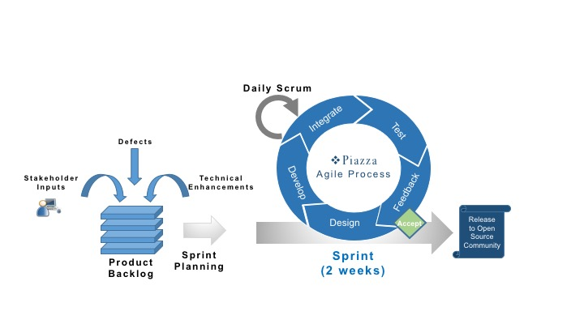

## Piazza Agile Development Process Overview

Piazza is developed using Agile management process framework known as
Scrum. The figure below depicts how software development for the Piazza
product.

