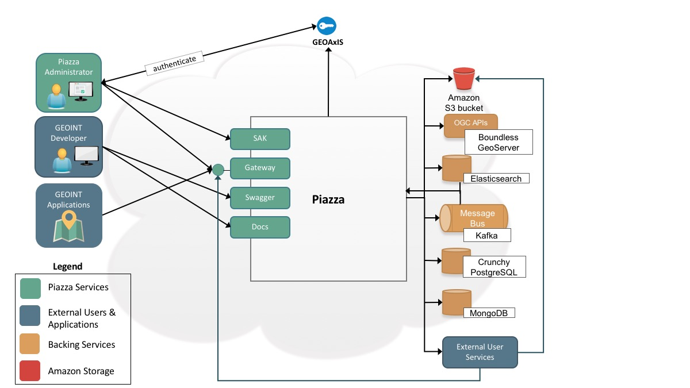
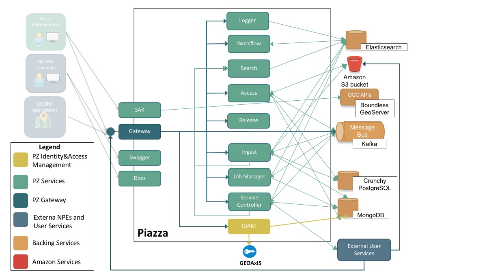

[*PDF*](devguide.pdf)

# Piazza Developer's Guide

Piazza is an open-source framework and tool-suite enabling rapid
geospatial information systems (GIS) solutions for the enterprise. It is
designed to do the heavy lifting needed by developers moving solutions
to the cloud. Piazza aims to support Non Person Entities (NPEs), such as
GEOINT applications, systems and services built to support the mission
in the areas of defense, intel, humanitarian and disaster relief. It
does this by focusing on bridging the gap between legacy approaches and
cloud based applications.

Implementing scalability for existing algorithms and web services is
typically done when built for the enterprise, but sometimes, these
approaches are not accessible for various reasons. It might cost too
much to allocate multiple resources or to obtain a larger EC2 instance.
Also, the user service or algorithm might not be architected to handle
multiple requests or requests containing large datasets. Even if it can
handle multiple user requests concurrently, it may have bottlenecks as
it tries to process large datasets.

For algorithms and web services which are not scalable for the
enterprise, Piazza provides capabilities to help existing algorithms and
web services deploy and be executable in the cloud without having to be
fully ready to handle these enterprise challenges. Piazza provides data
accessibility using OGC standards, load balancing of legacy algorithms,
on-demand scalability and orchestration support of algorithms and
services without the need for any new infrastructure.

With the enablement of the cloud, it can become difficult to locate
existing deployed algorithms and web services that can be useful in the
cloud to support the mission. Using Piazza, existing registered web
services and algorithms can be located so users can identify and use
capabilities which already exist to support the mission.

Piazza does this by providing a simple REST API to access geospatial
enterprise tools and capabilities. This allows for the flexible
deployment of algorithms and a framework for doing common, but often
complex, geospatial work. It also provides repeatable orchestration
support to combine individual tools and algorithms to solve common
geospatial challenges and to support this mission.

Using Piazza, NPEs can register/execute algorithms, obtain the data
results and load and access data using Open Geospatial Consortium (OGC)
standards or by leveraging the API to access data results. It also
provides support for load balancing of legacy algorithms without the
need for new infrastructure. Piazza aides to lower the barrier of entry
of GIS solutions into the enterprise by simplifying integration work and
providing on-demand enterprise scalability.

Piazza is part of the Venice Project, an open source community focused
on building cloud-based frameworks, tools, applications, and other
initiatives in support of Geospatial Intelligence (GEOINT) needs.

We welcome your interest, questions, and participation! Contact us at
<a id="contact_email"></a>.

## Introduction

The Piazza API is a series of REST endpoints that allow
Non Person Entities (NPEs) to access tools and interact with all of
Piazza’s core functionality. All NPE requests come into Piazza through
an entry-point called the Gateway. The Gateway is an abstract layer to
Piazza which hides the core services so NPEs can communicate with Piazza
using a single service endpoint. This architecture approach allows for
changes within Piazza to happen without affecting the NPEs.

Piazza leverages a number of backing services to enable the rapid
development of enterprise GIS solutions. The figure below shows a high
level overview of the interactions between Piazza and these backing
services.

All Piazza requests are authenticated with an API Key associated with
each request’s basic authentication headers. This API Key is generated
and held by Piazza’s Identity and Access Management (IDAM) component.



Developers have access to Piazza’s API documentation (Swagger) and
User’s Guide (Docs) to learn how to use Piazza’s REST API to implement
GEOINT solutions to support the mission. To review these items refer to
the References section for details.

To verify and administer Piazza’s capability, Piazza’s Swiss Army Knife
(SAK) web application provides Piazza administrators with dashboard view
into the Piazza system. Using this dashboard, administrators can verify
the operational capabilities of various Piazza microservices.

Piazza leverages MongoDB for system support, Elasticsearch for
searching/indexing support and Crunchy PostgreSQL/PostGIS for processing
support of geospatial data. For activities that are time intensive and
to support internal microservice communication, Piazza uses Apache Kafka
for asynchronous messaging support. To provide access to enterprise
storage, Piazza leverages Amazon’s Simple Storage Service (S3) for
loading/accessing data processing results and geospatial data. NPEs can
also access geospatial data by using OGC standard APIs (Boundless
GeoServer).

### Piazza Agile Development Process Overview

Piazza is developed using Agile management process framework known as
Scrum. The figure below depicts how software development for the Piazza
product.


## Piazza Core Overview

The core functionality of Piazza is split up into several internal
components that are shown in the below diagram.



Piazza consists of a set of stateless microservices where core
capabilities are broken up into small independent deployable services.
Stateless microservices treat each request as an independent transaction
and do not rely on previous data or “state” from previous requests. The
Gateway takes the incoming Piazza requests and routes them to the
appropriate services. Figure 2 shows an overview of Piazza’s
microservices and how they interact with each other.

Communication between these microservices is done using two mechanisms.
The primary mechanism is using HTTPS where microservices communicate
directly by initiating requests and receiving responses. The second
mechanism is using asynchronous notifications where communication is
initiated when specific conditions are met. The second mechanism
leverages Apache Kafka message bus and Elasticsearch Triggers to provide
for asynchronous notifications.

## Piazza Core Overview

The core functionality of Piazza is split up into several internal
components that are shown in the below diagram.


Piazza consists of a set of stateless microservices where core
capabilities are broken up into small independent deployable services.
Stateless microservices treat each request as an independent transaction
and do not rely on previous data or “state” from previous requests. The
Gateway takes the incoming Piazza requests and routes them to the
appropriate services. Figure 2 shows an overview of Piazza’s
microservices and how they interact with each other.

Communication between these microservices is done using two mechanisms.
The primary mechanism is using HTTPS where microservices communicate
directly by initiating requests and receiving responses. The second
mechanism is using asynchronous notifications where communication is
initiated when specific conditions are met. The second mechanism
leverages Apache Kafka message bus and Elasticsearch Triggers to provide
for asynchronous notifications.

## Job Manager

### Job Management Overview

For activities that are potentially time consuming such as the
invocation of user services (e.g. algorithms), the orchestration of user
services and loading of data results, Piazza leverages Apache Kafka for
asynchronous messaging support. Requests are sent to the Gateway as
**Jobs**. The Job Manager component obtains this information and creates
job messages for the Workflow, Service Controller and Ingest components
to obtain and work on. A unique *jobId* is used to track these jobs and
is provided back to the NPE as a response to the job request. NPEs use
the jobId to track the status of their job request. Leveraging Apache
Kafka, the Workflow, Service Controller and Ingest components send
updates about job status. Once the job is complete, data results are
loaded onto S3 or PostGreSQL for NPEs to access.

Endpoints that return a Job ID are documented and outlined in the
Swagger documentation.

    {
        "jobId": "my-job-id"
    }

The response may look something like the above. In this case, the
requesting user can then take the Job ID and re-query the Gateway with
the Job ID in order to get the latest status and progress of that Job.

When the Job has been completed, the result of the associated Job (being
a data ID, or service, or whatever the end result of the Job was) will
be contained in the status of that Job, including the time it was
completed and how long it took.

#### Example Job Manager Endpoints

The table below depicts examples of the various endpoints used for job
management.

<table>
	<thead>
		<tr>
			<th>Endpoint</th>
			<th>Description</th>
		</tr>
	</thead>
	<tbody>
		<tr class="odd">
			<td>/job</td>
			<td>Get Job Status</td>
		</tr>
		<tr class="even">
			<td>/abort</td>
			<td>Abort Job</td>
		</tr>
		<tr class="odd">
			<td>/repeat</td>
			<td>Repeat Job</td>
		</tr>
	</tbody>
</table>

### Building and Running Locally

Please refer to repository readme: <https://github.com/venicegeo/pz-jobmanager>

### Source Organization

The main logic of the Job Manager is split between two package. The
`controller` package contains the REST controller that contains the REST
endpoints for querying job status, etc. This is a simple Spring
RestController that contains the endpoints defined as simple functions.
The `messaging` package declares the Apache Kafka logic, where the
JobManager defines Kafka consumers to poll for incoming messages. The
messages pertain to 1) Creating new Jobs and 2) Updating the status of
Jobs. The Jobs are persisted in the MongoDB and interaction code to
handle the MongoDB commits is located in the `database` package.

### Interface

The main communication with the Job Manager is via Kafka from messages.
The Gateway sends "Request-Job" messages to the Job Manager in order to
index the running of new jobs. The components that process Jobs will
also send Kafka messages to the Job Manager in order to update the
status of running jobs.

The Job Manager also contains a series of REST endpoints that are used
for obtaining Job Status, or lists of Jobs.

### Piazza Database & Jobs Collection

The MongoDB instance uses a database titled `Piazza` with a single
`Jobs` collection. The interfaces exposed through the Dispatcher
messaging will be simple CRUD-style functionality. The JSON stored in
the Jobs collection will be stored using the [Common
Job](https://github.com/venicegeo/pz-jobcommon).

    {
        "type": "job"
        "jobId": "a10a04af-5e7e-4aea-b7de-f3dbc12e4279"
        "ready": false
        "status": "Submitted",
        "result": {},
        "progress": {
            "percentComplete": null
            "timeRemaining": null
            "timeSpent": null
        }
    }

#### Administrative API

The Job Manager provides a series of REST Endpoints that can be used to
query the Job Manager for certain information useful to NPEs and
utilities such as SAK.

Jobs returned through REST Endpoints will follow the JSON Model defined
in the [Job
Class](https://github.com/venicegeo/pz-jobcommon/blob/master/src/main/java/model/job/Job.java).

### REST Endpoints

`GET /job/count`  
Gets a count of the Jobs in the Piazza system.

`GET /job`  
Gets all of the Jobs in the Piazza system.

-   page: The start page for the query. Optional, default 0.

-   pageSize: The number of results per page. Optional, default 10.

`GET /job/status/{status}/count`  
Get Jobs Status Counts

-   status: The Status to get the count for.

`GET /job/status/{status}`  
Get Job by Status

-   status: The Status to get the Jobs for.

-   page: The start page for the query. Optional, default 0.

-   pageSize: The number of results per page. Optional, default 10.

`GET /job/userName/{userName}`  
Get Jobs by User ID

-   userName: The API Key of the user to query for Jobs submitted by.

-   page: The start page for the query. Optional, default 0.

-   pageSize: The number of results per page. Optional, default 10.

`GET /admin/stats`  
Administrative Statistics - Return object containing information
regarding the running instance of this component. Currently returns the
number of Jobs held in the Job Table, listed by status.

    {
        "running": 2,
        "fail": 0,
        "total": 19,
        "submitted": 0,
        "success": 16,
        "pending": 0,
        "cancelled": 0,
        "error": 1
    }

#### Job Workflow

The purpose of this page is to document the Workflow of the Piazza Core
Job process, and aims to show how Piazza Jobs are created and processed,
in order to give a better understanding of how the many internal Piazza
Core components communicate.

The concept of a Job is used internally by Piazza to manage long-running
processes that are not able to immediately be returned to a user. The
cases for when Jobs and Job IDs are generated are currently for:

-   Service Execution via the `/job` endpoint.

-   Data Loading via the `/data` and `/data/file` endpoints.

-   GeoServer deployments for Data using the `/deployment` endpoint.

#### Job Sequence

The Sequence for Jobs is as follows:

-   User Executes one of the above-mentioned, long-running processes
    through the Gateway.

-   The Gateway validates the Request, and passes the Request-Job topic
    to the Job Manager via Kafka

-   The Job Manager consumes this Kafka message and writes the Job
    metadata to the MongoDB Jobs table. It also forwarded along the
    Kafka topic for that Job.

-   Some internal Worker component (such as Ingest or Access) will
    consume the message.

-   The Worker will periodically update the Job Manager with Status
    Updates as to the progress of the Job. The Job Manager will write
    these updates to the Jobs table.

-   Once done, The Worker will alert the Job Manager that the Job has
    completed.

-   Along the way, the User can query for Job Status by creating another
    `/job` request to the Gateway. This response will give the user the
    progress, and when done, the final Result of the Job.

#### How Jobs an be Cancelled

Each Worker component (defined as a Component capable of processing
Jobs), such as Service Controller, Ingest, and Access, will join a
single Kafka consumer group together. By joining the same Kafka consumer
group, this ensures that as each component scales out towards N-number
of instances, only one instance of that component will receive an
incoming Job. In this way, Jobs are spread out among all instances
automatically by Kafka. This group name is often named based on the
component itself, for readability: For example, the `pz-ingest`
component Consumer group is called `ingest`.

However, there is the scenario where Jobs currently being processed by a
Worker Component will need to be cancelled. If there are N-number of
instances of a Worker component, then we’ll need to be able to ensure
that the Worker component handling a specific Job that is to be
cancelled is able to receive the Kafka message requesting the
cancellation. Because of this, the message cannot be consumed by the
general Kafka consumer group mentioned in the above paragraph: this is
due to the fact that in this case, if there are 5 instances of a
Component running, we cannot guarantee that the 1 Component instance
handling the job will be delivered that message by Kafka.

To solve this problem, each Component instance will define **two** Kafka
groups. One group will be the general component Kafka group. This is a
group that all instances of the Component will share, and this is the
group that will consume the messages that relate to Job processing. Each
Component will define a **second** Kafka group that is uniquely named.
Thus, for any specific Component, it may have two groups: One named
`ingest` used for general Job messaging and one uniquely named
`ingest-SOJ87asd68JDS` that will have the ability to react on each and
every message that comes in, and can be used to handle messages such as
Cancelling Jobs.

Worker components will receive Job messages through their general
consumer. Kafka will ensure that only one Component instance will
receive this message, so it is guaranteed that no two instances will
work the same Job. Worker components will receive Cancellation (or other
important messages) through their unique consumer. For cancellations,
every Consumer instance will receive this Kafka message and will have to
use inner component logic to determine if they are the instance who
currently owns that Job; and if so, they must take the action to cancel
the Job.

## Logger

### Overview

The Logger provides a system-wide, common way to record log messages. The log messages are stored in Elasticsearch. This is done though an HTTP API.

### Building and Running Locally 
To find out how to run the pz-logger service locally, please visit the github [README](https://github.com/venicegeo/pz-logger/blob/master/README.md)

### HTTP API

#### 'POST /syslog'

Sends a message to be logged. The message is given in the POST body as a JSON object:

    {
        "facility": 1,
        "severity": 7,
        "version": 1,
        "timeStamp": "2017-01-01T10:00:00.255Z",
        "hostName": "128.1.2.3",
        "application": "log-tester",
        "process": "1",
        "messageId": "",
        "auditData": null,
        "metricData": null,
        "sourceData": null,
        "message": "The quick brown fox"
    }

`timeStamp` is a `string` representing the message creation time, expressed in UTC [RFC 3339](https://www.ietf.org/rfc/rfc3339.txt). (In Go, `time.Now().Rount(time.Millisecond).UTC().Format(time.RFC3339)`).

`facility` and `version` are 1 by default

`severity` must be one of the following integers:

7 ("Debug")  
Only used during development, for debugging/tracing purposes.

6 ("Info")  
No action needed, I’m just being chatty and keeping you in the loop.

5 ("Notice")  
No *errors*, but further action might be required.

4 ("Warning")  
Something occurred which probably shouldn’t have. I’m going to handle it for you this time, but you really should have this looked at by someone soon.

3 ("Error")  
I can’t do this. I’ve handled the exception so I’m not going to crash or anything, but I want you to know that I may not be in a happy place right now.

2 ("Fatal")  
I’m sorry, Dave. I’m afraid I can’t do that. System crashing, or likely to crash very soon.

#### 'GET /syslog'

Returns a JSON object of log messages:

    {
        "statusCode": 200,
        "data": [
            {
                "facility": 1,
                "severity": 6,
                "version": 1,
                "timeStamp": "2016-07-18T12:43:10.079Z",
                "hostName": "0.0.0.0",
                "application": "notset",
                "process": "",
                "messageId": "",
                "auditData": nil,
                "metricData": nil,
                "sourceData": nil,
                "message": "..."
            },
            {
                "facility": 1,
                "severity": 6,
                "version": 1,
                "timeStamp": "2016-07-18T12:43:09.865Z",
                "hostName": "0.0.0.0",
                "application": "notset",
                "process": "",
                "messageId": "",
                "auditData": nil,
                "metricData": nil,
                "sourceData": nil,
                "message": "..."
            }
        ],
        "pagination": {
            "count": 123,
            "order": "desc",
            "page": 1,
            "perPage": 2,
            "sortBy": "createdOn"
        }
    }

This endpoint supports pagination, as described in the [Pagination](https://pz-docs.int.dev.east.paas.geointservices.io/devguide/index.html#pagination) section.

### Common operations

This service includes the common endpoints described in the [Common Endpoints](devguide/#common_endpoints) section.

The `admin stats` supported are:

    {
        "createdOn": "2016-07-18T12:43:09.865052883Z",
        "numMessages": 1234
    }

## Gateway

Handles all user-facing requests to Piazza via REST endpoints. The
purpose of this component is to allow for external users to be able to
interact with Piazza data, services, events, and other core Piazza
functionality.

### Building and Running Locally

Please refer to repository readme:<https://github.com/venicegeo/pz-gateway>

### S3 Credentials

The Gateway is responsible for pushing uploaded files (such as for
Ingest jobs) to the Piazza S3 instance. As such, the Gateway containers
will require environment variables to be established for passing in the
values for the S3 Access key and the S3 Private Access key to be used.
These values are referenced in the ENV variables
`vcap.services.pz-blobstore.credentials.access_key_id` and
`vcap.services.pz-blobstore.credentials.secret_access_key`. If you are a
developer and you do not have these values on your host, you will not be
able to Ingest files into the Gateway.

### Code Organization

The Gateway uses a series of Spring RestControllers in order to manage
the number of REST Endpoints that the Gateway API provides. These are
located in the `controller` package, and are broken up into separate
objects by their functionality. The `auth` package defines how Gateway
authenticates users through the `pz-idam` project. The logic for turning
on Authentication is located in the `Application.java` class - this is
handled by either enabling or disabling the `secure` Spring profile. If
this profile is enabled, then authentication is active and will point to
`pz-idam` for basic authentication credentials. If this profile is
disabled, then the Gateway will not require any authentication for
incoming requests.

### Interface

The Gateway API provides a series of REST endpoints that enable users to
work with data, services, events, and triggers. See the Swagger
documentation for a complete documentation and listing for all available
Gateway API endpoints. See Swagger documentation for the Gateway for
specific endpoints, payloads and responses.

### Authentication and Authorization

Authentication and authorization is handled via the `pz-idam` component.
This authentication becomes active when the `secure` Spring profile is
enabled in the Gateway. When authentication, all requests to the Gateway
will require basic authentication (standard base64-encoded) with
usernames and passwords defined in `pz-idam`.

## Job Request

In the case of long-running Jobs, such as Data loading, or Service
execution - the Gateway implements the concept of a Job as a handle to
this long-running process. In cases where a direct result is not able to
be returned through the Gateway, then the user will instead receive a
Job ID. This Job ID is then used to track the progress of the
long-running process as it is handled internally by Piazza components.

Each Job sent to the Piazza system through the Gateway is assigned a
UUID. This UUID is then used to uniquely identify the Job within the
system. This Job ID can then be used to check the status of the
long-running Job process in order to get information such as status,
progress, or time remaining.

The typical request for getting the status of a Job to the Gateway will
look like:

    GET /job/{{jobId}}

This will return any progress, or status information. When the job is
done, this will also contain a `result` field which will contain a
reference to the resulting objects of the Job. The result will look like
the following:

    {
        "type": "status",
        "jobId": "8504ceff-2af6-405b-bd8a-6804e7759676",
        "status": "Submitted",
        "progress": {
            "percentComplete": 50,
            "timeRemaining": null,
            "timeSpent": null
        }
    }

The resulting JSON will contain the current status information for that
Job. The `status` and `progress` objects contain information to the
Job’s current status.

If the Job has encountered an error, then this information will also be
available in the resulting JSON.

### Job Abort

Users who submit a Job that is currently running, can request that Job
be cancelled using the DELETE operation on the `job` endpoint. This will
dispatch the event throughout the Piazza application that all components
handling this Job should stop immediately.

    DELETE /job/{{jobId}}

### REST API

Please see the Jobs section in this document for more information on the
specific endpoints that the Gateway provides. For live documentation,
see the Swagger files.

## SAK (Development/Debug UI Tool)

While the communication with Gateway primarily is performed by NPEs
through HTTP(S) requests via RESTful interfaces, the Swiss Army Knife
(SAK) is a UI front end for testing, demonstrating and administration of
Piazza services. SAK is a web application that administrative users can
log into to execute certain requests through the Gateway, and more
importantly, track logging and other reporting information about the
internal details of Piazza. This tool is intended for administrative
users only; those who needs direct access to Piazza outside of just the
user API.

SAK will be used by developers as an easy way to test the functionality
of the services. It uses HTML/CSS/Javascript to make HTTP calls to
Piazza services and runs inside of [NGINX](http://nginx.org/). The UI is
unit tested using [Karma](https://karma-runner.github.io/0.13/index.html) 
and [Jasmine](http://jasmine.github.io/2.4/introduction.html).

### Source Organization

This app is setup as a static web application and is a single module
AngularJS app. The important sections include:

-   `/conf` - This contains an example config file for a local version of nginx

-   `/public` - This contains all of the source code and what actually gets deployed to nginx

-   `/public/nginx.conf` - This is the config file that nginx uses on the deployed server

### Running SAK locally

#### Requirements

-   Code cloned from <https://github.com/venicegeo/pz-sak>

```
    git clone https://github.com/venicegeo/pz-sak.git
```
    
-   [Nginx 1.8.1](http://nginx.org/en/download.html)

#### Steps

1.  Copy pz-sak/conf/nginx.conf to nginx-1.8.1/conf

2.  Modify nginx.conf to point root to your local copy of the repository’s /public directory (line 50)

3.  From a command line run `start nginx.exe`

4.  Go to <http://localhost>

Note: The following commands are helpful as well:

-   `nginx -s reload` - Updates changes to the conf

-   `nginx -s quit` - Shuts down nginx

Troubleshooting:

-   If you’re having trouble with your proxies, it may be because your
    network is preventing 8.8.8.8 from resolving as the default DNS. You
    can just replace that with the DNS that your machine uses. You can
    find your DNS by running `ipconfig /all` in Windows. It’s important
    to configure the proper DNS for your network for dynamic proxies to
    work properly.

### Running SAK from the cloud

#### Requirements

-   Web-browser (we typically test in Chrome but any modern browser
    should work)

#### Steps

1.  Open your web-browser

2.  Go to: <http://pz-sak.venicegeo.io/>

### Using SAK

#### Login

In order to login to SAK you may need credentials for your Piazza
installation. If you do not yet have a username and password, please
contact us.

#### Sections of SAK

Upon login, you are redirected to the Home page where you are given a
list of commonly used links and locations of services. Here are further
details on using these services through SAK.

#### Access

In this section you can list all pieces of data that have been loaded
into Piazza. If you’re looking for something specific, you can look up
the data object by it’s Data ID. All data is returned in raw JSON
format, so you can view the response as close to what services that
connect to Piazza would be seeing.

#### Jobs

Here you can check the status of specific jobs using the Job ID,
retrieve resource data with a Data ID, or just browse through all the
jobs that have been requested.

#### Loader

The loader allows the upload of text and files into the Piazza system.
Currently supported through the UI, the user may choose Text to load or
Select a GeoTIFF that they have locally. The metadata field can be a
JSON object such as the following:

    {
      "name": "Metadata name",
      "key": "value"
    }

When the user selects Text, the Content is the text to be loaded. When
the user selects File, the user should then use the file selector to
choose the appropriate file from the local storage.

Coming soon:

The Piazza service support more file types - like shapefiles and geojson
- as well as links to outside files (not necessarily in local storage).
Also supported is files that won’t be hosted by Piazza, but just linked
to another source. SAK will support all of these use cases in the future
but currently only supports Text and GeoTIFF.

#### User Service Registry

This is where a user can Register, Execute, and manage services. If you
have a service that you would like to run within the Piazza system, you
just have to register your service here. The short form requires:
Service Name, Method, Service URL, Response Type, and Description.
Currently, the url has to be something that is accessible for Piazza to
actually get to it. Once the service is registered you will be given a
service ID to be used for calling the service.

Executing the service involves entering JSON for the system to know
where the service is and what parameters to pass to the service. The
following is a very simple example of what to put in this field:

    {
        "type": "execute-service",
        "data": {
            // The unique identifier for your service
            "serviceId": "00af1e83-167b-43c1-b60b-16c2b8d7be2f",

            // Any inputs that your service will expect
            "dataInputs": {},

            // A list of outputs that your service will be responding with
            "dataOutput": [{
                "mimeType":"application/json",
                "type":"text"
            }]
        }
    }

Other options available for User Service registry include: \* List -
here you can list all services, update and delete services \* Search -

#### Design

SAK uses AngularJS and Bootstrap to create a simple UI for accessing
REST endpoints exposed through Piazza services. Each Piazza service will
be listed in the left tree pane. When selecting a service any functions
associated will be listed on the page that appears, and some services
will have more functions than others.

### UI mockups 

## Access

The Access component is what handles the accessing of this data - either by requesting metadata, requesting file downloads, or requesting GeoServer deployments of data. When requesting GeoServer deployments of loaded data into Piazza, the Access component will transfer the appropriate files over to the GeoServer data directory, and then create a deployment lease that provides a guarantee for a certain length of time that the data will be available on the Piazza GeoServer instance.

### Building and Running Locally

Please refer to repository [README](https://github.com/venicegeo/pz-access)

### S3 Credentials

The Access component deploys files uploaded to S3 by the Gateway. 

These values are referenced in the ENV variables:

	vcap.services.pz-blobstore.credentials.access_key_id
	vcap.services.pz-blobstore.credentials.secret_access_key 

If you are a developer and you do not have these values on your host, you will not be able to deploy files to GeoServer using a local debug instance.

### Source Organization

The main logic of the Access component is split between two packages:

1. Controller

	The [`controller`](https://github.com/venicegeo/pz-access/tree/master/src/main/java/access/controller) 
	package contains the Spring RestController class that defines REST endpoints 
	that handle user queries for DataResource information, and other REST endpoints used.

2. Messaging

	The [`messaging`](https://github.com/venicegeo/pz-access/tree/master/src/main/java/access/messaging) package defines Kafka consumers which listen 	for messages through Kafka for creating GeoServer deployments. The logic for the deploying of data resources as GeoServer layers happens in the 		[`deploy`](https://github.com/venicegeo/pz-access/tree/master/src/main/java/access/deploy) package through the [`Deployer.java`](https://github.com/venicegeo/pz-access/blob/master/src/main/java/access/deploy/Deployer.java) and [`Leaser.java`](https://github.com/venicegeo/pz-access/blob/master/src/main/java/access/deploy/Leaser.java) classes. These two classes manage the deployments of GeoServer (Deployment.java), and managing their life 		times and resource cleanup [`Leaser.java`](https://github.com/venicegeo/pz-access/blob/master/src/main/java/access/deploy/Leaser.java). In the 			[`Leaser.java`](https://github.com/venicegeo/pz-access/blob/master/src/main/java/access/deploy/Leaser.java) class that is a method [`reapExpiredLeases()`](https://github.com/venicegeo/pz-access/blob/master/src/main/java/access/deploy/Leaser.java#L136) that runs once a night that will clean up any expired resources on GeoServer.

The Access component interacts with the MongoDB DataResource collection, and management for this code is located in the [`database`](https://github.com/venicegeo/pz-access/tree/master/src/main/java/access/database) package.

### Interface

For users requesting deployments, the Access service listens to Kafka messages. The interfaces allow users to request Deployments of data currently loaded into Piazza, or more simply to just query the Data that is currently ingested into Piazza. Access also handles some Gateway API Endpoint requests based on the `/data` endpoint, which are used for retrieving geospatial metadata or other information related to loaded Piazza data.

## Querying Metadata

After processing a Job through the `Loader` component, a Data Resource will be added to the Piazza system. The Access component provides a Gateway API Endpoint Job which will allow users to query the metadata for the data that has been ingested into Piazza.

    /data/{dataId}

The response for this request will be all of the metadata currently held in Piazza for this Resource:

    {
        "dataId": "03810dc8-82a8-4cbc-95c1-75699142f95c",
        "dataType": {
            "content": "This text itself is the raw data to be ingested. In reality, it could be some GML, or GeoJSON, or whatever.",
            "mimeType": "application/text",
            "type": "text"
        },
        "metadata": {
            "classType": {
                "classification": "unclassified"
            },
            "description": "This is a test.",
            "name": "Testing some Text Input"
        }
    }

The `dataId` field is the unique ID for this dataset. The `dataType` field describes all information required for describing the type of file, format, and location of the data. The `spatialMetadata` will include information such as Bounding Box and Coordinate Reference System. The `metadata` field will contain other metadata information such as `contact` or `classification`.

### Accessing Data

Currently, there are two ways to get data out of Piazza. The first is retrieving the raw file that was initially ingested. The second is to get a live GeoServer deployment of the ingested data.

## File Access

This will simply retrieve the file for a Resource item. The Gateway API Endpoint is:

    /data/file/{dataId}

The response for this request will be the actual bytes of the file.

## Deployments

### GeoServer Deployments

A better way to Access data, instead of accessing the raw file, is to have Piazza stand up a GeoServer service that can be used to access vector data as Web Feature Services (WFS) or raster data as Web Coverage Services (WCS). This is handled by POSTing to the `/deployment` Gateway API endpoint.

    POST /deployment

    {
        "type": "access",
        "dataId": "d42bfc70-0194-47bb-bb70-a16346eff42b",
        "deploymentType": "geoserver"
    }

#### Deployment Leases

A Lease represents an amount of time that a deployed resource is available in the system for. Deployments should be guaranteed to be available as long as they have an active Deployment lease. A Lease is considered active as long as its expiration date has not passed. If the expiration date of a lease has passed, then the resource may still be available (perhaps it has not been subject to resource reaping yet) but it will not be guaranteed. Periodically expired leases will be undeployed in order to avoid overtaxing the system with outdated or unused deployments.

### Supported Data Types

The table below shows the different data types, as well as if there is access and hosted or not hosted.

<table class="table">
	<thead>
		<tr>
			<th>Data Type</th>
			<th>Access and Hosted</th>
			<th>Access and Not Hosted</th>
		</tr>
	</thead>
	<tbody>
		<tr class="odd">
			<td>Text</td>
			<td>Yes, direct text</td>
			<td>Not Applicable</td>
		</tr>
		<tr class="even">
			<td>Shapefile</td>
			<td>Yes, GeoServer</td>
			<td>Not Possible</td>
		</tr>
		<tr class="odd">
			<td>GeoTIFF</td>
			<td>Yes, GeoServer</td>
			<td>Not Possible</td>
		</tr>
		<tr class="even">
			<td>PointCloud</td>
			<td>Yes, GeoServer</td>
			<td>Not Possible</td>
		</tr>
		<tr class="odd">
			<td>Web Feature Service</td>
			<td>Yes, GeoServer</td>
			<td>Yes, via the external URL</td>
		</tr>
		<tr class="even">
			<td>GeoJSON</td>
			<td>Yes, GeoServer</td>
			<td>Not Possible</td>
		</tr>
	</tbody>
</table>

### Administrative API

The Access component provides a series of REST Endpoints that can be used to query the Data held by Piazza. This is provided for certain information useful to utilities like the Swiss-Army-Knife (SAK). It provides nothing more than a debug look into the system. These endpoints would most likely be locked down in production. 

The requests are as follows:

#### REST Endpoints

##### Data Count
`/data/count`  

Gets a count of the Resources held in the Piazza system.

#### Administrative Statistics
`GET /admin/stats`

Return object containing information regarding the running instance of this component. This will return the list of Job IDs of currently processing Jobs owned by this component.

    {
        "jobs": ["job-id-1", "job-id-2"]
    }

## Ingest

The Ingest component is the internal component that handles the loading of spatial data. This component is capable of referencing data held in external locations, such as another accessible S3 file store; or loading data specified by the user to be stored directly within Piazza. The Ingest component receives Kafka messages from the Gateway, with the information as to the file to be stored. It then inspects the data to validate and populate metadata fields (such as Area of Interest) and then stores this metadata within the Piazza MongoDB instance.

### Building Running Locally

Please refer to repository [README](https://github.com/venicegeo/pz-ingest)

### S3 Credentials

The Ingest component inspects files uploaded to S3 by the Gateway. As such, the `pz-ingest` component is also dependent on the following ENV variables:

	vcap.services.pz-blobstore.credentials.access_key_id
	vcap.services.pz-blobstore.credentials.secret_access_key

### Source Organization

The [messaging](https://github.com/venicegeo/pz-ingest/tree/master/src/main/java/ingest/messaging) package in source contains the classes that handle the incoming Kafka messages, which contain the information regarding the data to be ingested. The [`IngestWorker`](https://github.com/venicegeo/pz-ingest/blob/master/src/main/java/ingest/messaging/IngestWorker.java) class contains the majority of this logic. When new data is ingested, the data information is passed onto inspectors located in the [`inspect`](https://github.com/venicegeo/pz-ingest/tree/master/src/main/java/ingest/inspect) package. There is an inspector for each type of data ([GeoJSON](https://github.com/venicegeo/pz-ingest/blob/master/src/main/java/ingest/inspect/GeoJsonInspector), [GeoTIFF](https://github.com/venicegeo/pz-ingest/blob/master/src/main/java/ingest/inspect/GeoTiffInspector.java), [Point Cloud](https://github.com/venicegeo/pz-ingest/blob/master/src/main/java/ingest/inspect/PointCloudInspector.java), [Shapefile](https://github.com/venicegeo/pz-ingest/blob/master/src/main/java/ingest/inspect/ShapefileInspector.java), [Text](https://github.com/venicegeo/pz-ingest/blob/master/src/main/java/ingest/inspect/TextInspector.java), [WFS](https://github.com/venicegeo/pz-ingest/blob/master/src/main/java/ingest/inspect/WfsInspector.java)). These inspectors will dig into the data to validate and parse out any relevant metadata. The inspectors are what will create the [`DataResource`](https://github.com/venicegeo/pz-jobcommon/blob/master/src/main/java/model/data/DataResource.java) objects and store them into the MongoDB instance.

The [controller](https://github.com/venicegeo/pz-ingest/tree/master/src/main/java/ingest/controller) package contains the administrative REST endpoints for this component.

### Interface

In order to Load data, a message will be posted to the Gateway to create an Load job. There are two Gateway API endpoints to load data.

    POST /data

This first endpoint takes in a JSON payload only. This is used when a file does not need to specified - and instead, an S3 path or public folder share location is used to load the data.

    GET /data/file

This second endpoint is a multi-part POST request which takes in an actual geospatial file and loads this into Piazza data holdings.

The JSON payload for either of the above endpoints will look like:

    {
        "type": "ingest",
        "host": true,
        "data" : {
            // Description of the Data Here
        },
        "metadata": {}
    }

The metadata fields under the `jobType.data` tag are defined in the [DataResource](https://github.com/venicegeo/pz-jobcommon/blob/master/src/main/java/model/data/DataResource.java) POJO object. This object contains the [ResourceType](https://github.com/venicegeo/pz-wps/blob/master/pizza_wps_2_0/src/main/java/org/w3/_1999/xlink/ResourceType.java) interface, which is listed in the ['model.data.type`](https://github.com/venicegeo/pz-jobcommon/tree/master/src/main/java/model/data/type) package. This package defines format types for each type of Data that Piazza currently supports: [Shapefiles](https://github.com/venicegeo/pz-jobcommon/blob/master/src/main/java/model/data/type/ShapefileDataType.java), [Text](https://github.com/venicegeo/pz-jobcommon/blob/master/src/main/java/model/data/type/TextDataType.java), [PostGIS Tables](https://github.com/venicegeo/pz-jobcommon/blob/master/src/main/java/model/data/type/PostGISDataType.java), etc.

The `host` parameter is set to true if Piazza should host the data internally. This should be the default behavior. If this is set to false, then Piazza will not store the data in its internal storage. It will merely provide a link to wherever this external data resides, and attempt to read whatever metadata it can. If you specify a `file` in the Multipart POST, and set the ingest flag `host` to `false`, then an error will be raised - this is because setting `host` to `false` is explicitly stating to the Ingest component that no data should be stored - only metadata.

When loading data, users will be encouraged to fill out as much `metadata` as possible, which follows the form of the [ResourceMetadata](https://github.com/venicegeo/pz-jobcommon/blob/master/src/main/java/model/job/metadata/ResourceMetadata.java) POJO.

### Ingest Process

The Gateway will receive the Ingest Job request and then forward the request along, via Kafka, to the Ingest component. If a file is specified in the initial request, the Gateway will store this file on disk immediately and then upload to AWS S3 storage. The S3 File path information is then attached to the message that the Ingest receives.

As the message is consumed by the Ingest component, the first thing is to parse out any available metadata from the user request. Additionally, any other available metadata is also automatically extracted based on file paths or resource URLs specified. This metadata information is stored in the Mongo Database in the Resources collection. This collection stores all information for each bit of data Ingested into Piazza.

### Supported Data Types

The following table outlines the supported data types in piazza:

<table class="table">
	<thead>
		<tr>
			<th>Data Type</th>
			<th>Ingest and Hosted</th>
			<th>Ingest and Not Hosted</th>
		</tr>
	</thead>
	<tbody>
		<tr class="odd">
			<td>Text</td>
			<td>Yes, stored in MongoDB, or file</td>
			<td>Not Applicable</td>
		</tr>
		<tr class="even">
			<td>Shapefile</td>
			<td>Yes, stored in PostGIS + raw file</td>
			<td>Possibly, if we have credentials passed to us</td>
		</tr>
		<tr class="odd">
			<td>GeoTIFF</td>
			<td>Yes, stored in S3</td>
			<td>Possibly, if we have credentials passed to us</td>
		</tr>
		<tr class="even">
			<td>PointCloud</td>
			<td>Yes, stored in S3</td>
			<td>Possibly, if we have credentials passed to us</td>
		</tr>
		<tr class="odd">
			<td>Web Feature Service</td>
			<td>Yes, stored in PostGIS</td>
			<td>Yes, referenced via external URL</td>
		</tr>
	</tbody>
</table>

### Example Ingest Requests

#### Text Ingest

Great for testing! This will upload some Text into Piazza and will be stored within the Resource database. The JSON Payload for this request takes on this form:

    {
        "type": "ingest",
        "host": true,
        "data" : {
            "dataType": {
                "type": "text",
                "mimeType": "application/text",
                "content": "This text itself is the raw data to be ingested. In reality, it could be some GML, or GeoJSON, or whatever."
            },
            "metadata": {
                "name": "Testing some Text Input",
                "description": "This is a test.",
                "classType": { "classification": "unclassified" }
            }
        }
    }

#### Shapefile Ingest

    {
        "type": "ingest",
        "host": true,
        "data" : {
            "dataType": {
                "type": "shapefile"
            },
            "metadata": {
                "name": "My Test Shapefile",
                "description": "This is a test.",
                "classType": { "classification": "unclassified" }
            }
        }
    }

#### GeoTIFF Ingest

GeoTIFF Raster files can be ingested.

        "type": "ingest",
        "host": "true",
        "data" : {
            "dataType": {
                "type": "raster"
            },
            "metadata": {
                "name": "My Test Raster",
                "description": "This is a test.",
                "classType": { "classification": "unclassified" }
            }
        }

#### GeoJSON Ingest

        "type": "ingest",
        "host": "true",
        "data" : {
            "dataType": {
                "type": "geojson"
            },
            "metadata": {
                "name": "My Test GeoJSON",
                "description": "This is a test.",
                "classType": { "classification": "unclassified" }
            }
        }

#### Web Feature Service (WFS) Ingest

Web Feature Services can be ingested and hosted within Piazza. If `host` is set to true, then Piazza will store the WFS data pulled from the provided endpoint into the Piazza PostGIS database. If the WFS is not able to be parsed, then an error will be thrown. All WFS URLs provided to Piazza must be accessible to the Ingest component. If advanced credentials or authentication is required, then it must be specified or else the request will fail (currently, WFS credentials are not implemented).

        "type": "ingest",
        "host": "true",
        "data" : {
            "dataType": {
                "type": "wfs",
                "url": "http://geoserver.dev:8080/geoserver/wfs",
                "featureType": "piazza:shelters",
                "version": "1.0.0"
            },
            "metadata": {
                "name": "My Test WFS",
                "description": "This is a test.",
                "classType": { "classification": "unclassified" }
            }
        }

### Workflow Events

In support of the [Workflow](https://github.com/venicegeo/pz-workflow) service, the Ingest component is capable of firing events, consumed by the Workflow, in order to let other Piazza components become aware of when new Data has been Ingested into Piazza.

#### Event Type

Upon the successful Ingest of any type of Data into Piazza (internal or external), the Ingest component will fire an Event. The Event is defined with the Workflow using the following template:

    {
        "name": "Ingest",
        "mapping": {
            "dataId": "string",
            "dataType": "string",
            "epsg": "short",
            "minX": "long",
            "minY": "long",
            "maxX": "long",
            "maxY": "long",
            "hosted": "boolean"
        }
    }

### Administrative API

The Ingest Component contains various REST Endpoints that can be used for query for run-time information on specific instances of this component.

#### Administrative Statistics
`GET /admin/stats`

Return object containing information regarding the running instance of this component. This will return the list of Job IDs of currently processing Jobs owned by this component.

    {
        "jobs": ["job-id-1", "job-id-2"]
    }

## Pz Search Services

The Piazza Core Search infrastructure includes two services with REST APIs:

1. [pz-search-metadata-ingest](https://github.com/venicegeo/pz-search-metadata-ingest)
	
	Service to accept a JSON structure for metadata ingest to the Piazza Elasticsearch cluster

2. [pz-search-query](https://github.com/venicegeo/pz-search-query). 
	
	Service that accepts queries to Piazza Elasticsearch instance for content discovery endpoints, accepting an HTTP POST of Elasticsearch query language (DSL).

As spatial data is loaded into Piazza, metadata is extracted and indexed by the Search component. When user services are registered, the metadata about the services is also are extracted and indexed. Once the metadata is indexed, NPEs can then submit queries to the Gateway to discover resources in the Elasticsearch metadata catalog.

### Building Running Locally

Please refer to repository README:

[pz-search-metadata-ingest README](https://github.com/venicegeo/pz-search-metadata-ingest)

[pz-search-query README](https://github.com/venicegeo/pz-search-query)

## Identity and Access Management (IDAM)

The Piazza Core pz-idam project is an internal component that provides REST endpoints for handling Authentication and Authorization. This is done by brokering the Authentication (AuthN) functionality to an external service (in this case, GEOAxIS); and using an internal series of interfaces for providing Authorization (AuthZ). This project is used by the Gateway in order to generate API Keys and provide full AuthN/AuthZ capabilities.

### Building and Running Locally

Please refer to repository [README](https://github.com/venicegeo/pz-idam)

### Code Organization

The pz-idam project uses a series of Spring RestControllers in order to manage the number of REST Endpoints that the pz-idam API provides. These are located in the [org.venice.piazza.idam.controller](https://github.com/venicegeo/pz-idam/tree/master/src/main/java/org/venice/piazza/idam/controller) package, and are broken up into separate controllers by their functionality.

### API Keys and User Profiles

All Piazza requests are authenticated and authorized using a Piazza-owned API Key. This API Key is stored and maintained in the IDAM project. In order to generate an API Key, IDAM delegates initial AuthN checks to an external authority (GEOAxIS). Once a user has proven their authentication to this external authority, then it creates a User Profile for that user and an API Key that is returned to the user. That user then associates that API Key along with every request they make through the Gateway. The Gateway, upon receiving requests, will delegate the AuthN/AuthZ checks for that specific API Key to this IDAM component. IDAM will verify that the key exists and is valid, and will check that the associated User Profile has authorization to access the specific resource they are trying to reach.

Each User Profile is associated with a single API Key. This API Key can be reset and recreated, but only one API Key is allowed per User Profile. User Profiles also contain information such as creation date, and also allows the user to track their activity in Piazza, such as the number of jobs they have submitted for a particular day.

### Local Debugging

When building pz-idam locally, it can be beneficial to disable the AuthN functionality of the component, which would otherwise reach out to the external authority for user accounts. In order to disable this, a local developer can set the `spring.profiles.active` to `disable-authn` which will disable all AuthN functionality. In this way, IDAM can be debugged locally without having to reach to an external provider.

### Authentication

The [PiazzaAuthenticator](https://github.com/venicegeo/pz-idam/blob/master/src/main/java/org/venice/piazza/idam/authn/PiazzaAuthenticator.java) interface is defined in the [org.venice.piazza.idam.authn](https://github.com/venicegeo/pz-idam/tree/master/src/main/java/org/venice/piazza/idam/authn) package. This is the interface that allows IDAM to determine Authentication credentials for allowing access to generation of API Keys. It currently contains one implementation, for GEOAxIS. This authenticates a set of credentials and provides back an Authentication Response, either successful login or failed attempts. In order to add new authentication providers, simply extend this interface and implement the appropriate methods.

These methods return the [AuthResponse](https://github.com/venicegeo/pz-jobcommon/blob/master/src/main/java/model/response/AuthResponse.java) model, defined in [JobCommon[(https://github.com/venicegeo/pz-jobcommon), which contains information as to whether or not the authentication succeeds, and if it does, it also contains a link to the UserProfile object which contains information on the user as provided through the authentication provider.

### Authorization

The [Authorizer](https://github.com/venicegeo/pz-idam/blob/master/src/main/java/org/venice/piazza/idam/authz/Authorizer.java) interface is defined in the [org.venice.piazza.idam.authz](https://github.com/venicegeo/pz-idam/tree/master/src/main/java/org/venice/piazza/idam/authz) package and contains an interface for implementing authorization. IDAM REST controller contains endpoints which perform authorization by checking if a Piazza API Key is authorized to perform a specific action. These actions are described in the [AuthorizationCheck](https://github.com/venicegeo/pz-jobcommon/blob/master/src/main/java/model/security/authz/AuthorizationCheck.java) model, which defines a [Permission](https://github.com/venicegeo/pz-jobcommon/blob/master/src/main/java/model/security/authz/Permission.java) object that outlines a specific HTTP Method and a URI. In this way, users can be granted fine-level authorization on every REST endpoint in the Piazza system.

Many authorizers can be chained together in order to expand the functionality of the IDAM component. If new authorizers should be added, then simply create a new package under [org.venice.piazza.idam.authz](https://github.com/venicegeo/pz-idam/tree/master/src/main/java/org/venice/piazza/idam/authz) and create a class implementing the [Authorizer](https://github.com/venicegeo/pz-idam/blob/master/src/main/java/org/venice/piazza/idam/authz/Authorizer.java) interface.

## Pz Service Controller

The Service Controller is handles the registration and execution of user services and algorithms. It acts as a broker to external services that allows users (developers) to host their own algorithmic or spatial services directly from within Piazza. Other external users can then run these algorithms with their own data. In this way, Piazza acts as a federated search for algorithms, geocoding, or other various microservices (spatial or not) to run within a common environment. Using the Piazza Workflow component, users can create workflows that will allow them to chain events together (such as listening for when new data is loaded into Piazza) in order to create complex, automated workflows. This satisfies one of the primary goals of Piazza: Allowing users across the GEOINT Services platform to share their data and algorithms amongst the community.

### Service Registration Types

There are three types of services, to support a variety of different workflows for existing REST services. The type of a Service is specified during registration of the Service.

To external users who are merely interacting with Services by executing them, these different types are entirely transparent. The differences only lie in the underlying execution of that Service.

For detailed explanations on any of these Service Types, please see the [Users Guide on Services](/userguide/5-userservices).

The first type is the *standard* type of Service registration. To specify this type, no additional parameters must be added to the registration payload - it is the default type. This will register a URL endpoint (and a method) that will be called whenever the user executes the Service through the Gateway. ServiceController will contact the service directly with the specified parameters and then store the result that is returned from the Service. This is the most simple form of execution.

The second type is the *asynchronous* type. This can be specified by saying `isAsynchronous: true` in the service Registration payload. This type handles cases where the external Service has some sort of internal job queueing mechanism that can be used in order to defend against a large amount of requests being sent to the server that could potentially overwhelm and crash the server. Using this type of Registration, the ServiceController will contact the Service initially with the inputs for an execution. That request is expected to immediately return with a unique Job ID (provided by the Service). ServiceController will then periodically query the Service for status on that particular job. When the Status is reported back as Success, then the ServiceController will make an additional request to acquire the results and store them in Piazza.

The last type is the *taskManaged* type. This is specified by saying *isTaskManaged: true* in the service Registration payload. This is designed to support the case where an existing Service has no job management system, or any way to defend against large amounts of requests. Using this Task Managed case, Service Executions will be placed in a Jobs Queue for that particular Service - no external request is made to the Service. Instead, the Service polls Piazza for Jobs in its queue for that Service. In this way, the Service is able to retrieve work only when it is able to handle it. Piazza performs the role of load balancing and job queueing for this Service. When results for a particular job are completed, then the external service sends those results directly back to Piazza.

### Building and Running Locally

Please refer to the repository [README](https://github.com/venicegeo/pz-servicecontroller)

## Workflow Service

## Overview 
The Workflow service enables the construction and use of "event" notifications to enable simple "if-this-happens-then-do-that" workflows. This is done though an HTTP API. 

For a walkthough visit the Users Guide, for a simple overview visit [pz-swagger](https://pz-swagger.geointservices.io//Workflow).

A user will follow these general steps:

1.  Register a new event type

2.  Register a trigger for that event type

3.  Send an event

4.  Poll for new alerts

5.  Go to 3.

### Building and Running Locally 
To find out how to run the pz-workflow service locally, please visit the github [README](https://github.com/venicegeo/pz-workflow/blob/readme-updates/README.md)

### Technical

#### Elasticsearch Interaction
[Elasticsearch](https://www.elastic.co/guide/en/elasticsearch/reference/current/index.html)
is the chosen database for the workflow service. Elasticsearch can be
defined as a *nosql* using Lucene query. This can provide powerful query
ability but at the cost of some inconveniences interacting with the
database. When running locally workflow will automatically attach to a
local elasticsearch instance, but when using an offsite elasticsearch
addition information must be provided in the VCAP services. Workflow has
been designed in a way to reduce elasticsearch’s *nosql* capabilites.
This is done by creating strict mapping types on all schemas. This
insures that elasticsearch will only accept documents that exactly match
the specified schema. Workflow uses two packages in order to communicate
with elasticsearch. The first of these is [pz-gocommon index
file](https://github.com/venicegeo/pz-gocommon/blob/master/elasticsearch/index.go).
This allows workflow to create simple communication with an index. This
index file itself relies on
[elastic.v3](http://gopkg.in/olivere/elastic.v3) to create the HTTP
traffic.

#### Kafka Interaction 
Information on Kafka can be found [here](https://kafka.apache.org/intro). In workflow, Kafka service information must be provided in the VCAP services. After an event *triggers* a trigger, a job is sent to kafka. The function for this can be found [here](https://github.com/venicegeo/pz-workflow/blob/ff8b869893f910145d5205ed2557f22ca0e1da24/workflow/Service.go#L206). Often when running workflow locally VCAP services are not provided, therefore no connection with kafka can be made, making jobs fail to be sent. A way of testing whether or not triggers work is checking to see if a kafka error was created in the workflow process terminal.

#### Other Required Services 
pz-workflow also requires two other services: pz-idam & pz-servicecontroller. These do not require the use of VCAP as they are part of the piazza system. Workflow will only fail to launch if it cannot contact the piazza system. Service controller is used in workflow to validate service uuids when creating a trigger. Found [here](https://github.com/venicegeo/pz-workflow/blob/3864890c012854223569212af85d36eb077d1725/workflow/TriggerDB.go#L54). Idam is used when a trigger is attempting to fire off a job, which idam can allow or deny. Found [here](https://github.com/venicegeo/pz-workflow/blob/ac6a9287aea9e9ec24a83a38e1b19895a14df730/workflow/Service.go#L782), however notice that the actual auth function is contained in [pz-gocommon](https://github.com/venicegeo/pz-gocommon/blob/master/gocommon/authz.go).

#### Programmatic Hierarchy 
The workflow service has three distinct hierarchical sections: `Server`, `Service`, `DB`. The Server is the top layer. This is where HTTP requests are forwarded two. The job of the `Server` functions is to call the correct function in the `Service` and return a valid json response. The `Service` contains the bulk of the operation. There are functions designed for support, such as `sendToKafka` or `newIdent`, and functions that mirror those in the `Server`. These functions perform the logic of whichever rest call was made, interacting with `DB`'s to do so. The `DB`'s interact with the index mentioned in the elasticsearch interaction section. The role of these functions is to provide higher level functions when communicating with elasticsearch, such as queries.

#### Notes

Unique parameter types for different event types For example, there are two event types. Event type `A` has variable `foo` type `string`. Now a different user wants to create an event type `B` that also has the variable `foo` but wants it to be type `float`. Using elasticsearch as is, this would not be possible. When creating a mapping, each variable and its type gets stored in elasticsearch, and there cannot be multiple types of the same variable. Knowing that each event type name must be unique, this is a simple problem to combat. Instead, the variables can simply be renamed, using dot notation, to `A.foo` type `string` and `B.foo` type `float`. This can be done when creating and event type and storing in elasticsearch, and when the event type is being retrieved it can simply be removed. This can all be done without the user being aware. The encoding is done [here](https://github.com/venicegeo/pz-workflow/blob/ac6a9287aea9e9ec24a83a38e1b19895a14df730/workflow/Service.go#L470), the decoding is done [here](https://github.com/venicegeo/pz-workflow/blob/ac6a9287aea9e9ec24a83a38e1b19895a14df730/workflow/Service.go#L330) and the called functions are as simple as this: 

	func (service *Service) addUniqueParams(uniqueKey string, inputObj map[string]interface{}) map\[string\]interface{} 
	{ 
		outputObj := map[string]interface{}{} 
		outputObj[uniqueKey] = inputObj 
		return outputObj 
	} 
	
	func (service *Service) removeUniqueParams(uniqueKey string, inputObj map[string]interface{}) map[string]interface{} 
	{ 
		if _, ok := inputObj[uniqueKey]; !ok 
		{ 
			return inputObj 
		} 
		return inputObj[uniqueKey].(map[string]interface{})
	} 

This in turn also effects trigger queries as the variables users are trying to query have had there names changed. This is accounted for [here](https://github.com/venicegeo/pz-workflow/blob/ac6a9287aea9e9ec24a83a38e1b19895a14df730/workflow/TriggerDB.go#L375) and the following functions.

#### Event index version number 

When creating a trigger, workflow creates a [percolator query](https://www.elastic.co/guide/en/elasticsearch/reference/2.0/search-percolate.html) in the events index. For simplicity, workflow allows percolator queries to contain dot notation for terms. This can only be done by tricking an index into thinking it is an index from elasticsearch 2.0, as this was the last time dot notation was permitted in percolator queries. This is done [here](https://github.com/venicegeo/pz-workflow/blob/ac6a9287aea9e9ec24a83a38e1b19895a14df730/db/000-Event.sh#L41).

## Job Common

The [Job Common](https://github.com/venicegeo/pz-jobcommon) (or Java Common) project is a Java library that contains various useful utility classes and serializable [models](https://github.com/venicegeo/pz-jobcommon/tree/master/src/main/java/model/) that are used commonly throughout the Java applications in the Piazza Core.

### Building and Running Locally

For instructions on how to include this library in your Java project, through Maven, please see the [Repo Documentation](https://github.com/venicegeo/pz-jobcommon). This contains all information needed to connect to the Piazza S3 Maven repository and include the Common library as a dependency in your `pom.xml` file.

### Spring Beans

This project contains a variety of Spring Beans that are used to wrap core Piazza services, such as the Logger, in order to provide a handy Java API for interactions that conform to Spring standards.

**IMPORTANT**: 
[PiazzaLogger](https://github.com/venicegeo/pz-javalogger/blob/master/src/main/java/org/slf4j/impl/PiazzaLogger.java) is created with `@Component` annotations, and can thus be `@Autowired` into your classes as normal. However, since these Beans are defined in an external project [`pz-jobcommon`](https://github.com/venicegeo/pz-jobcommon) then one slight change to your project annotation must be made to your Application file:

    @SpringBootApplication
    @ComponentScan({ "MY_NAMESPACE, util" })
    public class Application extends SpringBootServletInitializer {

In the above syntax, the `@ComponentScan()` annotation was added. This is required in order to tell Spring to search for `@Components` in additional namespaces to your own. In this case, we are telling Spring to look in the `MY_NAMESPACE` package, which is a placeholder for your projects own namespace (such as `gateway` or `jobmanager`) — this will ensure your own project Components get picked up. Additionally, we tell Spring to look for Components in the [util](https://github.com/venicegeo/pz-jobcommon/tree/master/src/main/java/util) namespace which is defined in the [pz-jobcommon](https://github.com/venicegeo/pz-jobcommon) project and contains the [PiazzaLogger](https://github.com/venicegeo/pz-javalogger/blob/master/src/main/java/org/slf4j/impl/PiazzaLogger.java) and [UUIDFactory](https://github.com/venicegeo/pz-jobcommon/blob/master/src/main/java/util/UUIDFactory.java) classes.

The above lines are required because, if not specified, Spring would only look for Components in the default project namespaces (represented by the placeholder `MY_NAMESPACE`) and would not find the components located in the [util](https://github.com/venicegeo/pz-jobcommon/tree/master/src/main/java/util) package, and thus you would receive errors when attempting to Autowire something like the [PiazzaLogger](https://github.com/venicegeo/pz-javalogger/blob/master/src/main/java/org/slf4j/impl/PiazzaLogger.java).

If you do not wish to use the [PiazzaLogger](https://github.com/venicegeo/pz-javalogger/blob/master/src/main/java/org/slf4j/impl/PiazzaLogger.java) classes as Autowired Components in your application (which is highly recommended!) then you are free to instantiate them as normal using the provided constructors. However, this is discouraged because you will have to inject the `url` values for each component directly from the constructor in order for these classes to function. It is much preferred to Autowire these components with appropriate `url` values (described in the below sections for each component) and letting Spring instantiate this for you.

## PiazzaLogger

Provides a Java API to the [pz-logger](https://github.com/venicegeo/pz-logger) component.

The PiazzaLogger Bean has required property values. These must be placed in your `application.properties` or `application-cloud.properties` file in order for these components to work when Autowired.

    logger.name=COMPONENT_NAME
    logger.console=true
    vcap.services.pz-elasticsearch.credentials.transportClientPort=9300
    vcap.services.pz-elasticsearch.credentials.hostname=localhost
    LOGGER_INDEX=piazzalogger
    elasticsearch.clustername=venice

The elastic search information must be included in the specified property names. In Cloud Foundry, this will point to the elastic search service.

If you want the `PiazzaLogger` class to also write to your local console (useful for debugging!) then you can specify the `logger.console` configuration value to `true`. All statements will then also be directed out to your local console.

Incorporating the `PiazzaLogger` class as a Component is simple.

    @Autowired
    private PiazzaLogger logger;

Logs can then be sent using the `.log(message, severity)` method. The `message` is simply the message you wish to Log. The `severity` is a list of acceptable severity levels defined in the `PiazzaLogger` class.

    public static final String DEBUG = "Debug";
    public static final String ERROR = "Error";
    public static final String FATAL = "Fatal";
    public static final String INFO = "Info";
    public static final String WARNING = "Warning";

Please reference these static variables when sending your Logs. For example:

    @Autowired
    private PiazzaLogger logger;

    logger.log("Something went wrong!", PiazzaLogger.ERROR);

### Models

`pz-jobcommon` also contains a variety of [models](https://github.com/venicegeo/pz-jobcommon/tree/master/src/main/java/model/) that map all of the JSON payload information that is passed throughout the Gateway and other internal components. These models are located in the 'model.*' namespace. These models are documented in the Swagger documentation, with regards to their usage in the Gateway API.

## Conventions

### Coding Conventions

#### General

-   Piazza APIs SHALL use [RFC 4122](https://www.ietf.org/rfc/rfc4122.txt) for UUIDs.

-   Piazza APIs SHALL use [ISO 8601](https://www.w3.org/TR/NOTE-datetime) for time/date formatting.

-   At the root of every [VeniceGeo](https://github.com/venicegeo) open source repository, please include this [license file](https://github.com/venicegeo/venice/blob/master/legal/LICENSE.txt)

-   In the header of every piece of source code in an open source repository, include this [snippet](https://github.com/venicegeo/venice/blob/master/legal/LICENSE-HEADER.txt)

#### Java

For general Java coding, follow the [Google Java Style coding standards](http://google.github.io/styleguide/javaguide.html)

The package naming convention should be:

-   Piazza Project: `org.venice.piazza.[component name]`

#### Go

#### Unit Testing

#### GitHub

New GitHub Repositories within the [github.com/venicegeo](https://github.com/venicegeo) community should be named using following convention:

-   Core Piazza Components: `pz-[COMPONENT NAME]`

-   VeniceGeo Services: `pzsvc-[COMPONENT NAME]`

#### REST API Conventions

#### JSON Conventions

All input and output payloads will be JSON.

Our default JSON style guide is the [Google JSON style guide](https://google.github.io/styleguide/jsoncstyleguide.xml).

Our field names will use `lowerCamelCase`, not `under_scores`.

#### JSON Fields

Fields containing resource ids should be named according to the resource type. For example, use `eventId`, not just `id`.

For fields containing "timestamp" information, use names of the form `<op>edOn`, e.g. `createdOn` or `updatedOn`. The values should be ISO 8601 strings; do not use Unix-style milliseconds-since-epoch.

Field names should be spelled with `lowerCamelCase`. Not `UpperCamelCase` and not `underscore_style`.

#### Pagination

`GET` requests that return arrays (or maps) of objects should typically support these query parameters for pagination:

-   `?page=INT`

-   `?perPage=INT`

-   `?sortBy=STRING`

-   `?order=STRING` // must be either `asc` or `desc`

For example, these two calls will return the 60 most recent log messages, in batches of 30, sorted by creation date:

    GET /messages?perPage=30&page=0&key=createdOn&order=asc
    GET /messages?perPage=30&page=1&key=createdOn&order=asc

#### Response Payloads

For success responses (`200` or `201`) from `GET`, `POST`, or `PUT`, the JSON object returned will be:

    {
        // required
        data: OBJECT
        type: STRING

        // used only if data is a map or an array
        pagination: {
            // all fields required
            count: INT
            page: INT
            perPage: INT
            sortBy: STRING
            order: STRING    // must be either "asc" or "desc"
        }

        // optional, for information about the request itself
        metadata: OBJECT
    }

The `type` field is a string that indicates the structure of the object in `data`. The valid strings are documented with the APIs.

For error responses (`4xx` or `5xx`), the response is:

    {
        // required
        message: string

        // any other fields allowed as needed, based on nature of error, such as:
        origin: string
        metadata: // opt
        stackTrace: // opt
        jobId: // opt
        frobNitz: // opt
    }

Note that `DELETE` requests will return a `200` and a success payload which may be empty.

### HTTP Status Codes

We generally only use these HTTP status codes.

`200 OK`  
The request has succeeded. The information returned with the response is dependent on the method used in the request. For `GET`, the response is an entity containing the requested resource. For `POST`, it is entity containing the result of the action.

`201 Created`  
The request has been fulfilled and resulted in a new resource being created. The newly created resource can be referenced by the URI(s) returned in the entity of the response. The origin server MUST create the resource before returning the 201 status code.

`400 Bad Request`  
The request could not be understood by the server due to malformed syntax.

`401 Unauthorized`  
The request requires user authentication, e.g. due to missing or invalid authentication token.

`403 Forbidden`  
The server understood the request, but is refusing to fulfill it and retrying with different authorization will not help. For example, use `403` when a resource does not support the requested operation, e.g. `PUT`. `403` may also be used in cases where user is not authorized to perform the operation or the resource is unavailable for some reason (e.g. time constraints, etc.).

`404 Not Found`  
The requested resource could not be found but may be available again in the future. Subsequent requests by the client are permissible.

`500 Internal Server Error`  
The server encountered an unexpected condition which prevented it from fulfilling the request.

### Operations (Verbs)

By default, all resources should support GET, POST, PUT, DELETE. If a verb not valid for a resource type, `403` should be returned.

Remember, `POST` is for creating a resource and `PUT` is for updating a resource.

`GET`  
returns `200` with a response payload containing the requested object,
or an array or map of objects

`POST`  
returns `201` with a response payload containing the created object

`PUT`  
returns `200` with a response payload containing the updated object

`DELETE`  
returns `200` with a response payload whose `data` field is set to `{}`

### URLs

Use `lowerCamelCase` in URLs and query parameters if needed to match the JSON field names. For example:

    GET /eventType?sortBy=eventTypeId   // YES!
    GET /eventtype?sortby=eventtypeid   // NO!

#### Common Endpoints

`GET /`  
This endpoint requests a "health check" for the service. The returned status code is `200` with a response payload containing a short, friendly text string.

`GET /admin/stats`  
This endpoint requests the current metrics for the service. The returned payload will contain an object with the metric data. Such data might include things like the time the service started, how many requests it has served, etc.

## Support

The Piazza team welcomes your questions and suggestions. Please contact
us at <a id="contact_email"></a>.

## Legal

Source code for Piazza is licensed under the [Apache License, Version
2.0](http://www.apache.org/licenses/LICENSE-2.0). Documentation, videos,
and other items are licensed under [Creative Commons Attribution 3.0
License](https://creativecommons.org/licenses/by/3.0/us/).

We welcome your open source contributions, but like many open source
projects we all contributors to sign a Contributor License Agreement
(CLA). This can be done as either an
[individual](https://github.com/venicegeo/venice/blob/master/legal/I-CLA.txt)
or as
[corporation](https://github.com/venicegeo/venice/blob/master/legal/C-CLA.txt).
Please contact us at <a id="contact_email"></a> for more information.
