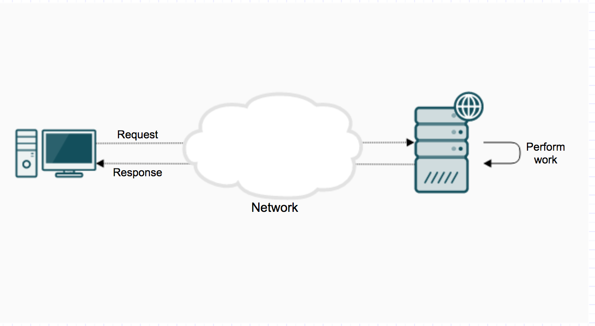
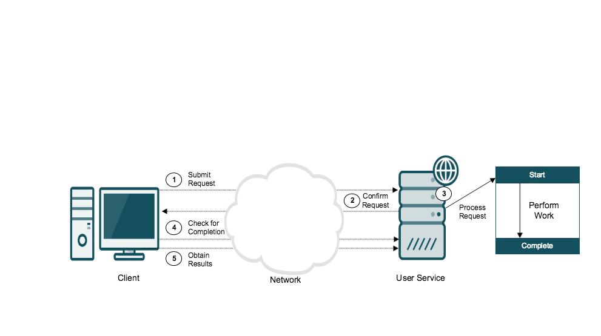
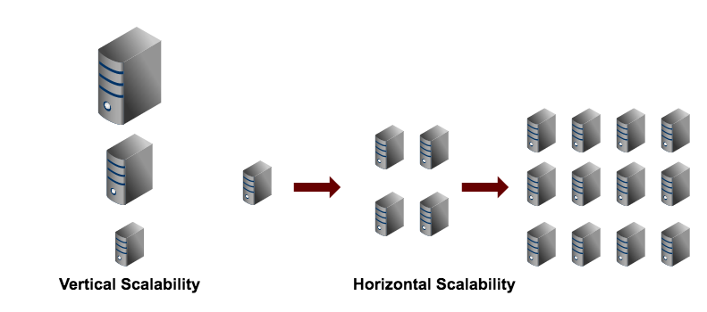
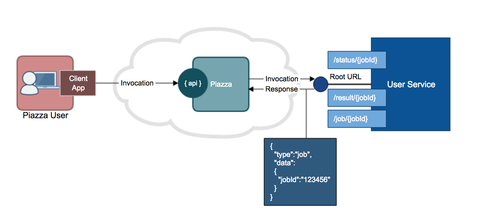
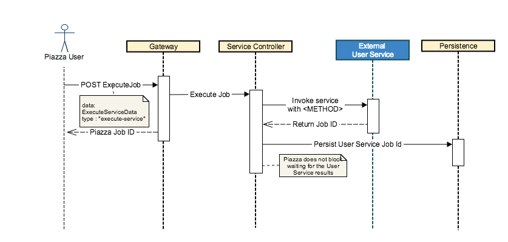

[*PDF*](index.pdf)

Piazza is an open-source framework and tool-suite enabling rapid
geospatial information systems (GIS) solutions for the enterprise. It is
designed to do the heavy lifting needed by developers moving solutions
to the cloud. Piazza aims to support Non Person Entities (NPEs), such as
GEOINT applications, systems and services built to support the mission
in the areas of defense, intel, humanitarian and disaster relief. It
does this by focusing on bridging the gap between legacy approaches and
cloud based applications.

Implementing scalability for existing algorithms and web services is
typically done when built for the enterprise, but sometimes, these
approaches are not accessible for various reasons. It might cost too
much to allocate multiple resources or to obtain a larger EC2 instance.
Also, the user service or algorithm might not be architected to handle
multiple requests or requests containing large datasets. Even if it can
handle multiple user requests concurrently, it may have bottlenecks as
it tries to process large datasets.

For algorithms and web services which are not scalable for the
enterprise, Piazza provides capabilities to help existing algorithms and
web services deploy and be executable in the cloud without having to be
fully ready to handle these enterprise challenges. Piazza provides data
accessibility using OGC standards, load balancing of legacy algorithms,
on-demand scalability and orchestration support of algorithms and
services without the need for any new infrastructure.

With the enablement of the cloud, it can become difficult to locate
existing deployed algorithms and web services that can be useful in the
cloud to support the mission. Using Piazza, existing registered web
services and algorithms can be located so users can identify and use
capabilities which already exist to support the mission.

Piazza does this by providing a simple REST API to access geospatial
enterprise tools and capabilities. This allows for the flexible
deployment of algorithms and a framework for doing common, but often
complex, geospatial work. It also provides repeatable orchestration
support to combine individual tools and algorithms to solve common
geospatial challenges and to support this mission.

Using Piazza, NPEs can register/execute algorithms, obtain the data
results and load and access data using Open Geospatial Consortium (OGC)
standards or by leveraging the API to access data results. It also
provides support for load balancing of legacy algorithms without the
need for new infrastructure. Piazza aides to lower the barrier of entry
of GIS solutions into the enterprise by simplifying integration work and
providing on-demand enterprise scalability.

Piazza is part of the Venice Project, an open source community focused
on building cloud-based frameworks, tools, applications, and other
initiatives in support of Geospatial Intelligence (GEOINT) needs.

We welcome your interest, questions, and participation! Contact us at
<venice@radiantblue.com>.

# Introduction

Welcome to the Piazza User Guide. It contains descriptions of Piazza’s
main features and many pieces of example code showing how to use those
features. This document is aimed at Piazza *users* — developers looking
to build services and applications that use Piazza. (In contrast, the
[Developer’s Guide](../devguide/index.html) is aimed at Piazza
*developers* — those wishing to work on the Piazza codebase itself.)

## Piazza In Brief

Piazza is a set of open source, cloud-based services aimed at helping
users (developers) build GEOINT applications and services. These
services are exposed via Representational State Transfer (REST)
endpoints, providing developers with the ability to:

Load data into the system  
Given a reference to an external data source, Piazza can extract
metadata and other information about that data and record it locally
under a unique ID. These data sources can be such files as GeoTIFFs in
an S3 bucket, or features such as from a Shapefile or PostGIS database.
While Piazza typically needs to read the data source’s contents, it does
not need to store a copy of it locally.

Access data from the system  
Having loaded data into the system, Piazza can create access points such
as OGC endpoints or download links. Users can access the data by passing
requests to Piazza, using the data resource’s ID.

Search data within the system  
Piazza stores the metadata about the data sources, allowing users to
submit queries and receive in return a list of data resources matching
the criteria.

Execute external services  
Users will wish to execute external web services, such as querying a
gazetteer for a given location or extracting vector features from an
image. Services can be registered by REST endpoints, descriptions, and
parameter lists. Then Piazza can execute these services on the user’s
behalf. The services can reference data loaded into Piazza (using the
data’s resource ID) or externally via URL.

Detect events and trigger actions  
Piazza allows users to define *event types*, such as the loading of a
new file within a certain bounding box or the successful completion of
an external service; *events* of those types can then be generated from
within the system or sent to the system from the outside. Users then
create *triggers* — actions to be taken when certain event conditions
are met — thus allowing Piazza to be responsible for executing simple
"workflows" of activities.

Piazza is not unique in its ability to offer these services. Developers
could, for example, use a message queuing system to implement their own
event and trigger system or stand up their own WPS server for invoking
external services. It is our position, however, that in many cases
developers shouldn’t have to do either of those. For many common needs
within the target environment, Piazza can provide a simple alternative.

## A User’s View of Piazza

From the outside, Piazza is a web service that exposes several REST
endpoints for performing such operations as loading data and invoking
user services.

Following the REST model, Piazza supports the usual HTTP verbs (`POST`,
`GET`, `DELETE`, etc.) and models objects within the system as
*resources* with unique IDs (UUIDs). For example, to load a file into
Piazza, one might `POST` to `/data` a JSON object that describes an
image in an S3 bucket. If the operation is successful, an ID such as
`b72b270a-168f-466a-a7eb-952a3da7fc8b` will be returned. The user can
then issue a `GET` request to
`/data/b72b270a-168f-466a-a7eb-952a3da7fcb8` and get back a JSON object
containing information about that data resource.

Requests sent to Piazza can be either *short* or *long*. Short requests,
like most `GET` and `DELETE` operations, return their results
immediately. Long operations, like a `POST` to load a file, execute as a
*jobs* and therefore return a *job id*. Using its Job Id, a client can
query for the status of the job and, when completed, the result of the
job.

Internal to Piazza, hidden from users, are a set of web services that
implement and support the operations that Piazza provides. These
services include operations like storing metadata, serving up feature
data via WFS, and tracking the status of executions of user services.
Also internal to the system are a number of "infrastructure" components
like Elasticsearch, GeoServer, PostGIS, and Kafka. Information about
Piazza’s internals can be found in the Piazza Developer’s Guide.

## An Example Application

Let’s consider an example of an application that might use
Piazza — shoreline boundary extraction. Detailed, current information
about shoreline locations, expressed as vector (linear) features, is an
important resource for everything from monitoring coastal erosion to
planning amphibious landings. An automated system for updating shoreline
boundaries would be very useful.

Therefore, let us imagine that you have been asked to build an
application that runs 24/7 to continually update a database of shoreline
vectors. You have been given access to a repository of global satellite
imagery and this repository is continually being updated with new data.
You have also been given three different algorithms that compute
shoreline vectors from such imagery; none of the three work perfectly
and some are better than others for detecting certain types of
shoreline, e.g., estuaries. Because none of them work flawlessly all the
time, the algorithms return a "confidence" metric for each computed
shoreline vector; if the confidence is "low," the imagery and the
candidate vector must be reviewed manually.

Your application will need to perform the following operations:

1.  The image repository must be monitored for a new image to appear.

2.  When a new image is available, its metadata must be extracted (size,
    spatial bounding box, cloud cover percentage, etc.)

3.  Using that metadata, the image’s suitability must be determined,
    based on whether the image contains any coastal regions (using the
    bounding box) and if the image’s quality is high enough (using the
    cloud cover measure).

4.  If the new imagery is suitable, it must be sent to each of the
    shoreline extraction algorithms.

5.  As each algorithm completes, its returned vectors must be either
    sent to a user for manual inspection (if confidence is low) or
    inserted into the official shoreline database (if confidence is
    high).

Piazza can be used to help implement all of these operations.

1.  A service must monitor the imagery repository for new data and when
    new data appears, it must be loaded into Piazza.

2.  When an image is loaded into Piazza, the image’s metadata is
    extracted and stored within Piazza.

3.  A workflow-like "rule" must be constructed. Example: whenever *(a
    new image is loaded and its bounding box intersects this polygon and
    its cloud cover is below a threshold)*, then *(invoke each of the
    algorithms, ideally in parallel, using the loaded image’s Resource
    Id as the input)*.

4.  Again use a workflow rule. Example: when *(all three algorithms have
    completed)*, then

    1.  If *(the confidence is low)*, then *(issue a manual-check-needed
        alert, whose payload consists of the data Resource Id, the
        candidate vector, and the confidence value)*.

    2.  If *(the confidence is high)*, then *(perform a database
        insert)*.

5.  Within some client application, periodically poll Piazza for
    manual-check-needed alerts and when found, present the data to the
    user for evaluation.

# Hello, Piazza!

In this section, we will work through the steps to make your first
Piazza service call.

## Setup

Prior to using the Piazza API, you need to have an API key and two
environment variables set properly.

# Setting `$PZSERVER`

The `$PZSERVER` environment variable needs to be set to the host name of
your Piazza instance. Typically this will look something like:

    $ export PZSERVER=piazza.venicegeo.io

# Generating Your API Key

For secure access to Piazza, each HTTP request must include an API key
specific to your account. Assuming you have already set `$PZSERVER` in
the previous section, you can generate a key from the command line:

    $ curl -u USERNAME:PASSWORD https://$PZSERVER/key

where `USERNAME` and `PASSWORD` are your actual username and password.
(You may need to put double-quotes around the password if it contains
"special" characters.)

The JSON response you get back will look similar to this:

    {
        "type" : "uuid",
        "uuid" : "45a1ba5d-cd7b-4c83-bd81-2fa2a03817d4"
    }

The `uuid` value, `"45a1..."`, is your new key.

# Setting `$PZKEY`

You can now set the `$PZKEY` environment variable to your new key, the
`uuid` value:

    $ export PZKEY=45a1ba5d-cd7b-4c83-bd81-2fa2a03817d4

As a convenience, if `$PZKEY` is not set, the example scripts look in
the file `$HOME/.pzkey` for the key for your server. The `.pzkey` file
contains just a JSON map from server names to keys:

    {
        "piazza.venicegeo.io": "45a1ba5d-cd7b-4c83-bd81-2fa2a03817d4",
        "piazza.pizza4all.com": "2525ad6a-aae9-41f0-9caf-c21b8fa4d7d2"
    }

If you have `$PZSERVER` set to `piazza.venicegeo.io`, the scripts will
set `$PZKEY` to the key `"45a1..."` to use for that Piazza instance.

## Some Notes About the Examples

The code examples in this guide are presented as shell scripts that use
`curl` for the HTTP calls and JSON for the request and response
payloads. To simplify the examples, the scripts rely on a setup script,
helpfully named [setup.sh](scripts/setup.sh), that will verify you have
`$PZSERVER` and `$PZKEY` (or a `$HOME/.pzkey` file) set correctly. It
will also define some helpful aliases and functions to make the examples
shorter, such as pre-setting some required options for `curl`.

Some of the example scripts require one or more input arguments. These
are expected to be provided on the command-line as simple strings. The
scripts will verify that the right number of arguments were provided.

The example scripts generally produce output. In most cases, the output
will be a JSON object to `stdout`.

As an extra aid for both learning and testing, the script
[runall.sh](scripts/runall.sh) is provided. This script runs each of the
example scripts in order, passing the outputs from one to the inputs of
the next, and verifying those outputs are correct. (To use `runall.sh`,
you must have the wonderful tool [jq](https://stedolan.github.io/jq/)
installed.)

## Hello!

With the setup work completed, we are now able to run a simple "health
check" ping to verify that we have a functioning instance of Piazza to
talk to. We do this by sending an HTTP `GET` request to the server’s
root endpoint, `/`.

[hello.sh](scripts/hello.sh)

    #!/bin/bash

    set -e

    . setup.sh

    $curl -X GET $PZSERVER

Note the line invoking `setup.sh`, mentioned above, and other
nonessential lines. In subsequent listings in this document, we will
omit those sorts of lines and only show the "important" commands. The
full script, however, is always available by following the download
link.

You can run this script simply as:

    $ ./hello.sh

and it should return a message similar to this:

    Hello, Health Check here for pz-gateway.

> **Note**
>
> You should verify that the health check script works correctly before
> continuing with this tutorial. If it does not work, make sure you have
> the right server name, a valid API key, and correctly set `$PZSERVER`
> and `$PZKEY` environment variables.

> **Note**
>
> For the remainder of this document, we will use `venicegeo.io` in
> embedded links. You will need to resolve the proper path manually for
> your site installation.

## Other Helpful Tools

As you work through this tutorial, you might find these two additional
Piazza resources helpful:

-   `pz-swagger` is a browser-based UI for exploring Piazza’s REST API.
    It is located at the same parent address as your `piazza` host,
    e.g., `pz-swagger.venicegeo.io`. If you are not familiar with
    Swagger, see [swagger.io](http://swagger.io).

-   `pz-sak` is a developer-level tool for directly interacting with
    some of Piazza’s public and private services. For example, you can
    use SAK to examine log files, check the status of jobs, and perform
    metadata queries. It too can be found under the same parent host
    address, e.g., `pz-sak.venicegeo.io`. SAK is a tool for debugging
    and testing only; it is not to be used in production. Contact the
    Piazza team for assistance with SAK.

# Data Load and Access

With this section, we begin to describe each of Piazza’s major APIs. We
will start with loading and accessing data.

## Load

Piazza provides the ability to load external data into the system.
Metadata is extracted from external data, stored within Piazza, and a
Resource ID is then returned. The metadata is also entered into Piazza’s
search index. Piazza supports several data formats today — including
GeoJSON, Shapefiles, and GeoTIFFs — with more to come as users require
them.

For example, the URL of a GeoTIFF stored in an S3 bucket can be sent to
Piazza and, once loaded, Piazza can perform other operations on the data
such as generating a WMS layer or sending the data to a user service.
The metadata for the file will include the S3 URL; therefore, the
Resource ID can be used as a global, unique reference to the data.

Piazza is not intended to be a storage system for user data and so
normally only the metadata is stored — not the file itself. We refer to
this as the *no-host* model.

In the no-host case, Piazza will need to have read-access to the file
and, in some cases, will have to copy the file to temporary local
storage in order to open the file and extract the metadata; when the
extraction is complete, the file is deleted. For large files, this will
incur a performance penalty.

Piazza also supports a *hosted* model in which the data is copied
locally for metadata extraction but *not* (immediately) deleted. This is
used for working files and other sorts of temporary storage; it is not
intended for long-term, persistent data storage.

# Loading an Image (Hosted Model)

> **Note**
>
> The GeoTIFF file used in these examples can be found at
> [terrametrics.tif](scripts/terrametrics.tif).

This example shows how to load a GeoTIFF file from your local file
system into Piazza, using the hosted model. The script will return a
JSON object describing the job that was created to perform the load
operation.

The script looks like this:

[post-hosted-load.sh](scripts/post-hosted-load.sh)

    #!/bin/bash
    set -e
    source setup.sh

    check_arg "$1" name
    check_arg "$2" description

    # tag::public[]
    name=$1
    description=$2

    data='{
        "type": "ingest",
        "host": true,
        "data": {
            "dataType": {
                "type": "raster"
            },
            "metadata": {
                "name": "'"$name"'",
                "description": "'"$description"'"
            }
        }
    }'

    # "curl_multipart" sets ContentType for a multipart POST body
    $curl_multipart -X POST \
        -F "data=$data" -F "file=@./terrametrics.tif" \
        $PZSERVER/data/file
    # end::public[]

The `curl` command is used to send both a JSON payload and the contents
of a binary file to the `/data/file` endpoint. Because we are passing in
both kinds of data, we use a multipart `POST` body and set the
`contentType` header accordingly; in most of the other examples we will
see, `contentType` is set to the usual `"application/json"`.

In the JSON request body, the `dataType.type` field denotes the file
type of the file being uploaded. Acceptable values are `geojson`,
`shapefile`, `raster`, `wfs`, and `pointcloud`. The `metadata` field
contains the series of optional key/value pairs for metadata that Piazza
will associate with this file.

Run the script from the command line as follows:

    $ ./post-hosted-load.sh myfirstfile "this is my first file"

In this case, `myfirstfile` is the input to the script that be used for
the custom metadata field `name` and "this is my first file" is for the
`description` field.

The response from this request will be a Piazza response object. It
contains a ubiquitous `type` field that describes what kind of data is
being returned in the `data` field. In this case, with a `job` response
object, the `data` field holds the ID of the job that was created:

    {
      "type" : "job",
      "data" : {
        "jobId" : "24019b46-f92f-412d-8877-9fc3c114dd6e"
      }
    }

The `jobId` can be used to fetch the status of the load operation that
opens the file in questions, extracts the metadata, and so on.
Requesting the status of a job is performed by executing a `GET` request
to the `job/{jobId}` endpoint. The response of this request will contain
current status information for the specified job, including the job’s
execution status, the user who submitted the job, and so on.

The `get-job-info` script can be used to do this `GET` request:

[get-job-info.sh](scripts/get-job-info.sh)

    #!/bin/bash
    set -e
    . setup.sh

    check_arg $1 jobId

    # tag::public[]
    jobId=$1

    $curl -XGET $PZSERVER/job/$jobId
    # end::public[]

It takes a single argument, the ID of the job, to get information about:

    $ ./get-job-info.sh 24019b46-f92f-412d-8877-9fc3c114dd6e

The response will be something like:

    {
        "type": "status",
        "data": {
            "jobId": "24019b46-f92f-412d-8877-9fc3c114dd6e",
            "status": "Running",
            "jobType": "IngestJob",
            "createdBy": "johndoe",
            "progress": {
                "percentComplete": 50
            }
        }
    }

or

    {
      "type" : "status",
      "data" : {
        "result" : {
          "type" : "data",
          "dataId" : "576ee63e-1359-430c-9242-26cbabc68d15"
        },
        "status" : "Success",
        "jobType" : "IngestJob",
        "createdBy" : "johndoe",
        "progress" : {
          "percentComplete" : 100
        },
        "jobId" : "24019b46-f92f-412d-8877-9fc3c114dd6e"
      }
    }

When the job is completed, the response for the request will have its
`status` field set to `Success` and will contain a `result` field. For a
load job, `result.type` will be `data` because the result is data loaded
into Piazza, and `result.dataId` will be the unique identifier of the
data that was loaded.

Just like we did to get information about a job, we can get information
about the data object and our image file looks something this:

[get-data-info.sh](scripts/get-data-info.sh)

    #!/bin/bash
    set -e
    . setup.sh

    check_arg $1 jobId

    # tag::public[]
    dataId=$1

    $curl -X GET $PZSERVER/data/$dataId
    # end::public[]

Running this script:

    $ ./get-data-info.sh 576ee63e-1359-430c-9242-26cbabc68d15

will return a response similar to this:

    {
      "type" : "data",
      "data" : {
        "dataId" : "576ee63e-1359-430c-9242-26cbabc68d15",
        "dataType" : {
          "type" : "raster",
          "location" : {
            "type" : "s3",
            "bucketName" : "frob-s3-nitz-pz-blobstore",
            "fileName" : "41f76b5c-fbaf-4543-9ff6-b1311ce1dff1-terrametrics.tif",
            "fileSize" : 63883,
            "domainName" : "s3.amazonaws.com"
          },
          ...
        },
        "spatialMetadata" : {
          "coordinateReferenceSystem" : "...",
          "epsgCode" : 4326,
          "minX" : -48.52855770516021,
          ...
        },
        "metadata" : {
          "name" : "myfirstfile",
          "description" : "mydescription",
          "createdBy" : "johndoe",
          "createdOn" : "2016-09-09T20:58:00.676Z",
          "createdByJobId" : "a1c76b5c-fbaf-4543-95f6-b1311ce1dff1",
          ...
        }
      }
    }

# Accessing the Hosted File

We can retrieve the file using the `/file/{dataId}` endpoint, like this:

[get-hosted-data.sh](scripts/get-hosted-data.sh)

    #!/bin/bash
    set -e
    . setup.sh

    check_arg $1 dataId
    check_arg $2 filename

    # tag::public[]
    dataId=$1
    filename=$2

    $curl -X GET $PZSERVER/file/$dataId?fileName=terrametrics.tif > $filename
    # end::public[]

and execute it like this:

    $ ./get-hosted-data.sh {dataId} myoutput.tif

We can also create an OGC-standard WMS endpoint for our GeoTIFF by
sending a `POST` request to `/deployment`:

[post-nonhosted-data-wms.sh](scripts/post-nonhosted-data-wms.sh)

    #!/bin/bash
    set -e
    . setup.sh

    check_arg $1 dataId

    # tag::public[]
    dataId=$1

    data='{
        "type": "access",
        "dataId": "'"$dataId"'",
        "deploymentType": "geoserver"
    }'

    $curl -X POST -d "$data" $PZSERVER/deployment
    # end::public[]

    $ ./post-nonhosted-data-wms.sh {dataId}

The response from this request will return a Job Id, because setting up
a WMS layer takes time and this is a long-running job. Checking the
status of the job is done using the ID as above. Once the job is
complete, information about the WMS layer can be retrieved through the
`deployment` field in the job response.

    {
      "type" : "status",
      "data" : {
        "result" : {
          "type" : "deployment",
          "deployment" : {
            "deploymentId" : "6a18fd50-0af8-403b-9401-ff4f2b657e2a",
            "dataId" : "576ee63e-1359-430c-9242-26cbabc68d15",
            "host" : "gsn-geose-LoadBala-17USYYB36BFDL-1788485819.us-east-1.elb.amazonaws.com",
            "port" : "80",
            "layer" : "576ee63e-1359-430c-9242-26cbabc68d15",
            "capabilitiesUrl" : "http://frob-nitz-788489819.us-east-1.elb.amazonaws.com:80/geoserver/piazza/wfs?service=wfs&version=2.0.0&request=GetCapabilities"
          }
        },
        "status" : "Success",
        "jobType" : "AccessJob",
        "createdBy" : "aristophanes",
        "progress" : { },
        "jobId" : "a0f2ad2a-06cb-43ff-a256-17ca56b5f4a2"
      }
    }

The `deployment` object contains the host, port, and layer name of the
data as hosted on the Piazza WMS instance. The capabilities URL can be
copied-and-pasted into a browser to view the capabilities of the
service. The WMS service can be used by any WMS-aware client
application.

## Non-hosted Image File

Loading a non-hosted image file is nearly identical to loading a hosted
image file. The differences are:

1.  The `host` field is set to `false`

2.  The `data.dataType.location` field is used to point to the external
    location of the file

3.  The `POST` request uses the `"application/json"` content type, not
    the multipart type, as no file attachment is specified in the
    request

In our example script, the `data.dataType.location` field is set up for
an S3 location, with the `bucketName`, `fileName` (sometimes called
key), and `domainName` parameters. Obviously, Piazza must have access to
this S3 bucket in order for load to succeed.

[post-nonhosted-load.sh](scripts/post-nonhosted-load.sh)

    #!/bin/bash
    set -e
    . setup.sh

    check_arg $1 name

    # tag::public[]
    name=$1

    data='{
        "type": "ingest",
        "host": false,
        "data": {
            "dataType": {
                "type": "raster",
                "location": {
                    "type": "s3",
                    "bucketName": "external-public-access-test",
                    "fileName": "elevation.tif",
                    "domainName": "s3.amazonaws.com"
                }
            },
            "metadata": {
                "name": "'"$name"'",
                "description": "mydescription"
            }
        }
    }'

    $curl -XPOST -d "$data" $PZSERVER/data
    # end::public[]

    $ ./post-nonhosted-load.sh mynewfile

From this point on, the workflow is identical to hosted files.

## Loading a GeoJSON File

Loading GeoJSON data is nearly identical to loading image files. The
differences are:

1.  The `type` of the `data.dataType` field is set to `geojson`

2.  The file uploaded should have a `.geojson` extension

For example, the request payload might be:

    {
        "type": "ingest",
        "host": true,
        "data": {
            "dataType": {
                "type": "geojson"
            },
            "metadata": {
                "name": "geojson_test",
                "description": "geojson_test"
            }
        }
    }

The processes for getting the job status, downloading the data, and
creating an OGC deployment (in this case, a WFS layer) follow the
image-based examples described above.

## Data API Documentation

See <http://pz-swagger.venicegeo.io/#/Data>

# Search

Piazza supports searching across the metadata extracted from all loaded
data. The search API returns the Resource IDs of any matching items.

Two kinds of searching are supported. First, when doing a `GET` on the
`/data` endpoint, you specify the keyword to be matched; the list
normally returned by a `GET` is filtered to contain just those resources
that match the keyword. This is called a *filtered* GET. Second, when
doing a `POST` to the `/data/query` endpoint, you provide an
Elasticsearch JSON object. Piazza uses the [Elasticsearch
DSL](https://www.elastic.co/guide/en/elasticsearch/reference/current/query-dsl.html)
directly (instead of inventing yet another query syntax language).

Note that adding data to the search index is an internal Piazza function
and therefore does not have an API.

## Setup

To demonstrate, we will first load three files into Piazza and set the
metadata fields with some interesting strings. (We will use the same
source [GeoTIFF](scripts/terrametrics.tif) since we only care about the
metadata.) And to do that, we need a script that loads the file with a
given name and description and returns the corresponding data Resource
ID. Fortunately, we wrote this script already,
[post-hosted-load.sh](scripts/post-hosted-load.sh). We will call it
three times.

[load-files.sh](scripts/load-files.sh)

    #!/bin/bash
    set -e
    . setup.sh

    # tag::public[]
    a="one"
    b="The quick, brown fox."
    one=`./post-hosted-load.sh "$a" "$b"`
    echo "$one"

    a="two"
    b="The lazy dog."
    two=`./post-hosted-load.sh "$a" "$b"`
    echo "$two"

    a="three"
    b="The hungry hungry hippo."
    three=`./post-hosted-load.sh "$a" "$b"`
    echo "$three"
    # end::public[]

This will return the information about three load operations:

    $ ./load-files.sh

## Filtered `GET` Example

Now that we have the files loaded, we will perform a filtered `GET`.
This script takes one argument: the keyword to search for. The server
will return a response with the metadata objects that matched the
keyword.

[search-filter.sh](scripts/search-filter.sh)

    #!/bin/bash
    set -e
    . setup.sh

    check_arg $1 term

    # tag::public[]
    term=$1

    $curl -X GET $PZSERVER/data?keyword=$term
    # end::public[]

Execute this script by passing in the keyword:

    $ ./search-filter.sh "dog"

## Query Example

We can perform a more advanced query on data with a `POST` request to
the `/data/query` endpoint, with the post body containing the JSON query
object.

[search-query.sh](scripts/search-query.sh)

    #!/bin/bash
    set -e
    . setup.sh

    check_arg $1 term

    # tag::public[]
    term=$1

    query='{
        "query": {
            "match": { "_all": "'"$term"'" }
        }
    }'

    $curl -X POST -d "$query" $PZSERVER/data/query?perPage=100&page=0
    # end::public[]

To execute:

    $ ./search-query.sh "kitten"

Visit the [???](#Elasticsearch Query Syntax) section for more details on
the Elasticsearch DSL.

## Search API Documentation

See <http://pz-swagger.venicegeo.io/#/Search>

# User Services

Piazza allows users to discover, manage, and invoke external web
services that are referred to as *User Services*. A web service is a
function that can be accessed over the web using HTTP. Web technologies
such as HTTP, JSON, and XML (Extensible Markup Language) are used when
creating web services because they allow for data to be exchanged in a
platform-independent manner.

Piazza users can combine user services to perform complex tasks
automatically such as orthorectifying an image, running statistical
analysis on the image, and then notifying an analyst that the image has
finished processing and is ready for review.

Piazza provides a REST API, allowing users to perform such user service
management activities as:

1.  Register user services in the Service Registry for search/discovery
    (see the [???](#Search) section for details)

2.  Update information on the user service (e.g., URL, name, version,
    and other metadata)

3.  Remove a user service from the registry

4.  View details about registered user services

5.  Invoke a registered user service to perform some sort of task

6.  Combine user services to perform various tasks (see the
    [???](#Workflow Service) section for details)

While Piazza’s overall goal is to provide users with the ability to
register and use existing RESTful user services, there are some
guidelines on writing user services to work best with Piazza. See the
[???](#How to Write Your Own User Services) section for details on how
to write for discovery and user from within Piazza.

## Types of User Services

Piazza recognizes that there are two types of User Services: Synchronous
Web Services and Asynchronous Web Services.

Synchronous Web Services, when invoked by a client, require the client
to wait (or block) until a response and/or results are returned before
the client can proceed with additional work. The figure below
illustrates an example of Synchronous Web Services.

Sometimes, however, the request submitted by the client may take a while
to process or processing may be delayed. In cases such as this, it is
beneficial to allow the client to continue working on other tasks while
the user service processes the submitted request.

To support this need, Piazza provides support for Asynchronous User
Services. With these types of services, clients are not blocked while
waiting for a response. See the
[???](#How to Write Your Own User Services) and the
[???](#Building in Asynchronous Support) sections for details on how to
write asynchronous user services.

> **Note**
>
> Piazza currently requires that you have the user service instance
> deployed at a public URL. In the future, the user service will be a
> deployable container (or jar file) so Piazza can scale the number of
> instances needed. The following sections will use a *Hello World*
> service. This service responds with “hello” when invoked. It is
> deployed in our cloud for testing services.

## Registration

A user service must be registered within the Piazza Service Registry
before it can be discovered or used by Piazza users.

To register a user service with Piazza, the client sends a JSON payload
with the URL of the service, a description of its parameters, and other
metadata to Piazza.

The `isAsynchronous` field is used to indicate whether a user service is
an asynchronous user service. This value is a boolean and should be set
to `true` if the user service supports the required Piazza endpoints for
asynchronous processing. This field can be set to `false`, or omitted,
if the user service does not intend to implement the asynchronous
endpoints and upon invocation will instead return the results
synchronously.

# Hello Example service registered with `GET` method

The service is registered by performing a `POST` request to the
`/service` endpoint.

    {
        "url": "http://pzsvc-hello.venicegeo.io/",
        "contracturl": "http://helloContract",
        "method" : "GET",
        "isAsynchronous" : "false",
        "resourceMetadata": {
            "name": "pzsvc-hello service",
            "description": "Hello World Example",
            "classType": {
                "classification": "UNCLASSIFIED"
             }
        }
    }

-   <https://pz-gateway.venicegeo.io/service> is the endpoint for
    registering the user service with the following required JSON
    attributes:

    -   The `url` field is the URL for invoking the service. This is the
        *Root URL* for the service.

    -   The `contracturl` field contains additional detail information
        about the service.

    -   The `method` field is used to indicate the desired action to be
        performed on the service. (`GET`, `POST`, `PUT`, `DELETE`, etc.)

    -   The `isAsynchronous` flag is used to indicate whether the
        service is an asynchronous user service and implements the
        asynchronous endpoints.

    -   The `resourceMetadata` field has three subfields with the name,
        description of the service, and the Class Type for the service:

        -   The `name` field is used to identify the name of the
            service.

        -   The `description` field is used to describe the service.

        -   The `classType` field is used to indicate the classification
            of the registered service.

> **Note**
>
> The description should be entered with some care because it will
> enable other users to search for your service.

Successfully registering a service will return JSON of the following
schema:

    {
        "type": "service-id",
        “data” : {
           "serviceId": "a04e274c-f929-4507-9174-dd24722d89d9"
        }
    }

The `serviceId` field should be noted since it will be used to invoke
the service.

An example script for registering the "Hello World" service and
returning the `serviceId` can be found at
[register-service.sh](scripts/register-service.sh). Run it in the
following way:

    $ ./register-service.sh

## Invocation

Once a user service is registered within Piazza, it can be invoked by
sending a `POST` request to the Piazza API job endpoint
`https://pz-gateway.venicegeo.io/job`. The `url` parameter in service
registration, along with the `method` parameter, will constitute the
execution endpoint. URL query parameters and/or the input being sent
into the service are specified in the `dataInputs` field.

For details on how to invoke a user service, see [Piazza Swagger
API](http://pz-swagger.venicegeo.io/#!/Service/executeServiceUsingPOST).

Piazza users invoking a user service will get a job response JSON
payload response in the following format: \`\`\` { "type":"job",
"data":{ "jobId”:”z42a2ea3-2e16-4ee2-bf74-fa7c792d1247" } } \`\`\` The
`jobId` field contains a unique identifier of the specific running
instance of the user service. This ID is used in subsequent requests to
obtain the status of the job and to perform other job management
capabilities.

# Hello Example service invoked with `GET` method

A script that does this can be found at
[execute-service.sh](scripts/execute-service.sh). Provide the
`serviceId` returned by the register script as the first argument to the
script:

    $ ./execute-service.sh {{serviceId}}

    {
        "type": "execute-service",
        "data": {
            "serviceId": "a04e274c-f929-4507-9174-dd24722d89d9",
            "dataInputs": { },
            "dataOutput": [{ "mimeType":"application/json", "type":"text" }]
        }
    }

The `serviceId` is set to the return value from registering the service.
In this example, no `dataInputs` are specified because there are no
required parameters or payloads to invoke this service.

For details on the various ways to specify Data Inputs into the service,
see [Invoking a service, POST
Job](https://pz-swagger.venicegeo.io/#!/Service/executeServiceUsingPOST)
in Swagger for details.

For `dataOutput`, the `mimeType` refers to the actual Multipurpose
Internet Mail Extensions (MIME) type(s) of the service output. The type
refers to how the output will be stored until retrieved (see below). The
return value is not the result of the service call. The execute-service
call creates a job and returns the Job ID of that job.

`dataOutput` is specified as an array to allow for cases in which a user
service will return multiple items from the service. For example, a
given user service may return a JSON payload along with storing a
generated raster image somewhere in a shared S3 bucket.

    {
        "type": "job",
        "data" :
                 {"jobId": "e42a2ea3-2f16-4ee2-bf74-fa7c792c0847"}
    }

# Hello Example service invoked with `POST` method

When invoking a service that requires a POST body for input, the body
message is specified in the content field — the `type` is `"body"` and
the `mimeType` has to be specified. Getting the `jobId` is exactly the
same as with the `GET` request.

    {
        "type": "execute-service",
        "data": {
            "serviceId": "{{serviceId}}",
            "dataInputs": {
                "test" : {
                    "content" : "{ \"name\": \"Fred\", \"count\": 4 }",
                    "type" : "body",
                    "mimeType" : "application/json"
                }
            },
            "dataOutput": [{ "mimeType":"application/json", "type":"text" }]
        }
    }

# Getting the Status and Results of an Invocation

The status of a user service invocation is returned by sending a `GET`
request to `https://pz-gateway.venicegeo.io/job/{{jobId}}` where `jobId`
is the ID returned when executing the service. Piazza users should call
this endpoint to determine the status of a running service.

## Status Details The granularity of the status provided depends on
the type of user service that has been invoked. For synchronous user
services, the status returned may be in the following format:

\`\`\` { “data” : { "status":"Running" } } \`\`\`

The acceptable statuses are as follows: `Pending`, `Running`, `Success`,
`Cancelled`, `Error`, `Fail`.

For details on status reporting for asynchronous services, see
&lt;Building Asynchronous Support&gt; to see the various types of
statuses that can be returned.

## Getting the Results

Once the user service has finished executing, the resulting data can be
accessed by the Piazza user. Using the provided Data ID, users can
retrieve the data results by sending a `GET` to the Piazza API data
endpoint. For details on using this endpoint, see the [Piazza
API](http://pz-swagger.venicegeo.io/#!/Data/getMetadataUsingGET).

The example below shows an example of job response depicting a
successful execution.

    {
        "type": "status",
        "data": {
            "jobId": "e42a2ea3-2f16-4ee2-bf74-fa7c792c0847",
            "result": {
                "type": "data",
                "dataId": "b92e7cc5-310e-4a72-a4ab-21661b58d601"
            },
            "status": "Success",
            "jobType": "ExecuteServiceJob",
            "createdBy": "{{PZUSER}}",
            "progress": {}
        }
    }

A script that checks the status of the job can be found at
[get-job-info.sh](scripts/get-job-info.sh). The script takes the `jobId`
returned from the `execute-service.sh` script as its only argument:

    $ ./get-job-info.sh {{jobId}}

Finally, the actual result is returned by sending a `GET` request to
`https://pz-gateway.venicegeo.io/data/{{dataId}}` where the `dataId` is
from the `result.data.dataId` field of the returned status. In this
case, the result is text.

    {
        "type": "data",
        "data": {
            "dataId": "b92e7cc5-310e-4a72-a4ab-21661b58d601",
            "dataType": {
                "content": "Hi. I'm pzsvc-hello.",
                "type": "text"
            }
            "metadata": {
                ...
            }
        }
    }

Run the [get-data-info.sh](scripts/get-data-info.sh) script to check the
result of the previous job. This script also takes a single argument:
the `dataId` returned by the previous script:

    $ ./get-data-info.sh {{dataId}}

# Cancelling an Invocation

During execution of a Piazza job, the Piazza user who invoked a user
service may also request to cancel or abort that job. Using the `jobId`
that was provided from the invocation, a user can cancel a job using the
`DELETE` method on the `https://pz-gateway.venicegeo.io/job/{{jobId}}`
endpoint. For more details on how to use this, see the [Piazza API Abort
Job](http://pz-swagger.venicegeo.io/#!/Job/abortJobUsingDELETE).

## Other Examples

For more examples on how to register and execute your service, see the
[Piazza Developer’s
Guide](http://pz-docs.venicegeo.io/devguide/index.html).

## How to Write Your Own User Services

User Services are external web services that service developers write to
be utilized by various users. When these services are registered within
Piazza’s Service Registry, they can be discovered and invoked by any
Piazza user. For example, suppose a developer has created an algorithm
that does processing of point cloud data and wants to share it with
others to use. He or she would create a user service and then register
it with Piazza so that others may use it. Once a user service is
registered with Piazza, Piazza users will be able to discover and invoke
it to support the workflow in the applications that need it.

If a registered user service has additional security and access
requirements (e.g., client certificate required, pre-authorization to
use, etc.), users should contact the user service provider to negotiate
access for use.

The contact information for each user service is located in the
`resourceMetadata` field of the service payload. For details on the
fields available when registering a user service, see the [Piazza API
User Service
Registration](http://pz-swagger.venicegeo.io/#!/Service/registerServiceUsingPOST)
for details.

# Designing Your User Service

When designing your user service, it should be written as a RESTful web
service. REST is an architectural concept for creating client/server
networked applications, and clients and servers exchange data using a
stateless communication protocol such as HTTP.

## Establishing an API

To establish an API for exchanging data to and from your user service,
consider using the JSON standard because data payloads are smaller, are
easy to read, and work programmatically (e.g. using JavaScript).

XML is also used to exchange data with RESTful web services. With XML,
data is very structured and is stored in a markup language that is
readable. As a result of the formatting, XML payloads are much larger
than JSON payloads. With this approach, calling RESTful web services is
typically done by sending in URL parameters to the service with
responses from the service in an XML format. When using XML, a
well-documented schema should be used to validate and to describe the
responses that may be sent from your service.

For guidance on best practices when creating the RESTful API to your web
service, see the [18F API
standard](https://github.com/18F/api-standards) for details.

# Implementing Scalability

*Scalability* needs to be considered when developing a user service.
Scalability is the ability of your user service to handle a growing
amount of requests or work to meet the business or mission needs. There
are two types of scaling that needs to be considered:

-   *Vertical Scalability* - Achieved by adding or removing resources to
    a single machine, virtual machine, or node to support changes in the
    workload or user requests. Example resources include CPUs or memory.

-   *Horizontal Scalability* - Achieved by adding or removing machines,
    virtual machines, or nodes to support changes in the workload or
    user requests. Typically, a load-balancer is used to distribute
    multiple requests across many machines.

The figure below shows an example of each of these types of scalability
approaches.

Even though these are typical approaches for implementing scalability,
sometimes these approaches are not accessible for various reasons. It
might cost too much to allocate multiple resources or to obtain a larger
EC2 instance. Also, the user service itself might not be architected to
handle multiple requests or requests containing large datasets. It might
be able to handle multiple user requests concurrently but then have
bottlenecks as it tries to process data.

For this reason, Piazza has implemented *Task Management* to support
user services that are new, are being implemented iteratively, or are
just are not ready to handle large amounts of service invocations. Task
Management allows user service developers to poll Piazza for work
instead of taking service invocations directly from Piazza. The next
section discusses how to incorporate task management within your user
service.

# Task Management

Task Management is a capability that allows user service developers to
*poll* for work instead of being invoked directly by Piazza. To tell
Piazza that you are task-managed service, you must register your service
by setting the `isTaskManaged` attribute to `true`. Below is an example
JSON payload for using the `isTaskManaged` attribute with the other
required fields necessary during registration.

    {
        "url": "http://pzsvc-hello.venicegeo.io/",
        "contractUrl": "http://helloContract",
        "method" : "GET",
        "isTaskManaged" : "true",
            "taskAdministrators" : ["UserNameA", "UserNameB"],
            "timeout" : 500,
        "resourceMetadata": {
            "name": "pzsvc-hello service",
            "description": "Hello World Example",
            "classType": {
                "classification": "UNCLASSIFIED"
             }
        }
    }

The `taskAdministrators` array is used to specify the list of Piazza
user names that will have access to this service’s queue. Only these
user names will be able to poll for work and process jobs. Additionally,
the `timeout` can be optionally specified in order to tell Piazza how
many seconds to let pass before assuming a single job for this service
has timed out.

Note that a service that `isTaskManaged` does not communicate directly
with the external service in any way. As such, the `url` field in the
service registration payload does not necessarily need to represent a
functional endpoint for the service. Additionally, the `isAsynchronous`
field is ignored when `isTaskManaged` is set to true.

## Polling for Work

Once your user service is registered as a Task Managed service, Piazza
will not invoke the user service directly. Instead, your user service
should poll Piazza for jobs to work on by submitting a `POST` to
`https://pz-gateway.venicegeo.io/service/{{serviceId}}/task`. The
`serviceId` is the `serviceId` that was returned when you registered
your user service. If your service has any pending job executions, then
a single job will be returning from that POST. It will contain the
`data.serviceData` field that is the exact inputs the user sent to
invoke the user service. It also contains the `data.jobId` field that
will later be used to tell Piazza any updates for the status/results of
the job. If no jobs are in your queue, those fields will be `null`.

## Sending Status Updates for the Job

When you need to send Piazza status updates or results for the job your
user service is working on, submit a `POST` to
`https://pz-gateway.venicegeo.io/service/{{serviceId}}/task/{{jobId}}`.
The payload for this POST is a status update object, which is the exact
same model that you previously used in asynchronous services. For
details on this model, see the [???](#Status Details) section.

For example, if your user service failed to execute, the payload that
would be sent to Piazza would be:

\`\`\` { "status”:"Fail" } \`\`\`

If your user service completed executing and has results, the payload
that would be sent back to Piazza would be: \`\`\` { "status" :
"Success", "result" : { "type" : "data", "dataId" : "data\_id\_here" } }
\`\`\`

Metadata about your user service’s jobs queue can be obtained by
submitting a `GET` to
`https://pz-gateway.venicegeo.io/service/{{serviceId}}/task/metadata`.
The response will show the number of jobs in your user service’s jobs
queue.

## Timeouts in Task Managed Services

Optionally, the `timeout` parameter can be specified upon initial
service registration. If specified, Piazza will then periodically check
for jobs that have been pulled from the service queue that have exceeded
the duration of this timeout period. For example, if a service specifies
its timeout as five minutes long and a job runs for more than five
minutes, Piazza Task Management will consider this specific job as
*timed out*. When a task-managed job times out, it will be placed back
in the service queue and is available to be polled again by another
worker. If that specific service job fails two more subsequent times,
then it will be removed from the queue entirely and flagged as a failure
by Piazza.

## Building in Asynchronous Support

If you anticipate that your user service will be doing time-consuming
activities, then consider making it an asynchronous user service. To
provide for this functionality, Piazza recommends that the following set
of functions and behaviors be incorporated into your user service. The
following sections steps through each of these items.

## Service Invocation Response

For Piazza to track and work with your asynchronous service, a unique
identifier, or Job ID needs to be generated and returned to Piazza when
the service is invoked.

The "url" parameter in service registration, along with the "method"
parameter, will constitute the invocation endpoint. This URL will be
called directly with the specified HTTP method, and will be expected to
return a JSON payload with the following format:

\`\`\` {"type":"job","data":{"jobId":"123456"}}

\`\`\`

In the example above, Piazza will use the Job ID value of *123456* as
the ID for tracking your user service execution instance.

The image below shows details on the interaction between Piazza and the
user service during service invocation.

## Status Endpoint

For Piazza to be able to query the status of your user service, a status
endpoint has to be implemented. The endpoint `/status/{jobId}` and path
variable need to be added to the root URL of the service with support of
the HTTP GET method.

For example, if the root URL is `http://service/analysis`, then Piazza
will infer the status URL as HTTP `GET`
`http://service/analysis/status/{jobId}`.

Once an instance of your user service has been started (by Piazza
calling the invocation endpoint), Piazza will periodically call the
status endpoint in order to determine the current progress of this
instance. This includes the status of the service and any progress
information.

The figure below shows the interaction between Piazza and your user
service.

Your status endpoint should respond with the following JSON payloads.

For example: \`\`\` { "status":"Running" } \`\`\` The acceptable
statuses are as follows: `Pending`, `Running`, `Success`, `Cancelled`,
`Error`, and `Fail`. You can also include a `progress` field that is
able to contain a percentage completion for the job: \`\`\` {
"status":"Running", "progress" : { "percentComplete": 80 } } \`\`\` As
the services continue to process results, it should update the status as
needed. When your user service has completed, then it should set the
status to `Success.` Piazza, upon seeing this, will then initiate a
request to the results endpoint in order to fetch the results of this
instance when ready.

On `Error`, the status endpoint will also report error information. If
your service encounters an error during execution, it can report this
back in the status response:

\`\`\` { "status":"Error", "result" : { "type": "error", "message":
"Things went wrong.", "details": "Perhaps a Stack Trace here." } }
\`\`\`

The `result` field can define a message and details property that can be
used to convey error information back to the Piazza user who initiated
this instance of the user service. Once Piazza encounters an error
status, it will cease to poll for status and it will not attempt to
query the results endpoint.

# Result

When your user service reports back a `Success` status, then Piazza will
initiate a subsequent call to the results endpoint. The results URL will
be extended from your root URL by adding a `/result/{jobId}` endpoint
and path variable.

For example, if the root URL is `http://service/analysis`, then Piazza
will infer the results URL as HTTP `GET`
`http://service/analysis/result/{jobId}`. The return value for this
response should be identical to the return value from the execution
endpoint of a traditional synchronous user service.

When Piazza initiates a successful call to the results endpoint of a
service, it should be considered a guarantee that Piazza will make no
further queries related to that execution instance.

# Cancellation

During execution of a Piazza job, the user who requested that job
execution may also request to terminate that job. In this case, Piazza
will use the cancellation endpoint of an asynchronous user service in
order to notify that any work related to that specific instance should
be terminated, and no subsequent calls will be made related to that
instance. The cancellation URL will be extended from the root URL by
adding a `/job/{jobId}` endpoint and path variable.

For example, if the root URL is `http://service/analysis`, then Piazza
will infer the cancellation URL as HTTP `GET`
`http://service/analysis/job/{jobId}`.

The ID of the instance can be used internally by the user service to
clean up any resources related to that instance. It can be considered a
guarantee by Piazza that no subsequent calls will be made related to
that instance.

# Output From Your User Service

Piazza supports a number of output formats generated from user services
registered within Piazza. User services should generate a Piazza
DataResource JSON payload as output conforming to defined Piazza
DataTypes defined within Piazza. For example, if the user service
generates plain text as an output format, the JSON payload that should
be returned from the user service should be a DataResource with the
`dataType.type` field set to `text`.

Piazza does not store data such as raster images, large GeoJSON
payloads, etc., so Piazza users should leverage the Piazza DataResource
payloads to indicate where output data is stored after it is generated
from the user service.

For example, if a user service generates a raster image, the output from
the service would be in a JSON payload format similar to the JSON
payload below:

    {
        "dataType": {
            "type": "raster",
            "location": {
                "type": "s3",
                "bucketName": "pz-svcs-prevgen-output",
                "fileName": "478788dc-ac85-4a85-a75c-cbb352620667-NASA-GDEM-10km-colorized.tif",
                "domainName": "s3.amazonaws.com"
            },
            "mimeType": "image/tiff"
        },
        "metadata": {
            "name": "External Crop Raster Service",
            "id": "478788dc-ac85-4a85-a75c-cbb352620667-NASA-GDEM-10km-colorized.tif",
            "description": "service that takes payload containing s3 location and bounding box for some raster file, downloads, crops, and uploads the crop back up to s3.",
            "url": "http://host:8086/crop",
            "method": "POST"
        }
    }

This output format is a DataResource payload that indicates the location
of a cropped raster image Amazon Web Service (AWS) Simple Storage
Service (S3) directory. Metadata about the user service that generated
the image along with other data is indicated in the `metadata` field of
the payload. The `mimeType` field indicates the type of raster image
that was generated.

When generating a DataResource payload, `type` and `mimeType` are
required for all DataTypes. Additional fields are required depending on
the type of data that is generated from the user service.

For details on the DataResource payload and the available DataTypes, see
the [Piazza Data
API](http://pz-swagger.venicegeo.io/#!/Data/getMetadataUsingGET).

## What to do About Existing Services

If you have an existing service, consider following the [18F API
standard](https://github.com/18F/api-standards) for guidance on best
practices. For existing services that are not RESTful, consider wrapping
these services with a REST representation. For example, the first
generation of web services included heavyweight approaches such as
Simple Object Access Protocol (SOAP), where messages were transmitted
using XML over HTTP. If converting the service to a REST representation
is not possible for services such as these, then consider wrapping these
services.

# Putting Your User Service into Action within Piazza

## Registering Your User Service

When registering your service, provide enough metadata about your
service so it can be searched and discovered using Piazza’s search
capability.

For details on the fields available when registering a user service, see
the [Piazza API User Service
Registration](http://pz-swagger.venicegeo.io/#!/Service/registerServiceUsingPOST)
for details.

When registering a service, the following fields are required:

1.  `url`

2.  `method`

3.  `contractUrl`

4.  `isAsynchronous`

5.  `resourceMetadata.name`

6.  `resourceMetadata.description`

7.  `resourceMetadata.classType`

# Availability of Your User Service

User services registered within Piazza have an `availability` field that
indicates the status/health of the service. Services can have an
availability value of `ONLINE`, `OFFLINE`, `DEGRADED`, and `FAILED`.
When your user service is initially registered with Piazza, the status
of that service is automatically set to `ONLINE` within the Piazza
Service Registry.

Below is an example of the payload to send to update your service’s
status:

    {
      "resourceMetadata" : {
        "availability" : "OFFLINE"
      }
    }

Piazza continually monitors the health of user services registered in
the service registry. Piazza continually monitors these user services
and when response time from these services starts to be slow, Piazza may
set the status of a registered user service, to `DEGRADED`. If the user
service is unresponsive over a period of time, the status of the user
service may be changed to `FAILED`.

## Service API Documentation

See <http://pz-swagger.venicegeo.io/#/service> for the complete User
Service API.

# Workflow Service

Piazza provides the ability for users to define and send an *event*,
representing an event that has happened. These events can be issued
either from within Piazza or by an external client. Piazza also allows
for users to define *triggers*, containing both an event-condition and
an action; when the condition is met, the action is performed. Event
types, events, and triggers can be used to define *workflows* when taken
together.

## The EventType

The user first defines an event type that is the schema for the events
that the user will be generating. The event type object is sent in a
`POST` request to the `/eventType` endpoint and contains a unique `name`
(string) and a mapping describing the EventType’s parameters. For
example:

    {
        "name": "testevent-1468849135",
        "mapping": {
            "filename": "string",
            "code":     "string",
            "severity": "integer"
        }
    }

The `name` must be unique across all event types in the system. Our
practice is to use a namespace prefix, followed by colon (`:`), before
the name.

The available data types are `string`, `boolean`, `integer`, `double`,
`date`, `float`, `byte`, `short`, and `long`. By no coincidence, these
are the basic types that Elasticsearch supports.

This script shows an example of registering an EventType.

[post-eventtype.sh](scripts/post-eventtype.sh)

    #!/bin/bash
    set -e
    . setup.sh

    # tag::public[]
    eventtype='{
        "name": "test-'"$(date +%s)"'",
        "mapping": {
            "ItemId": "string",
            "Severity": "integer",
            "Problem": "string"
        }
    }'

    $curl -X POST -d "$eventtype" $PZSERVER/eventType
    # end::public[]

Note we use the current date/time to generate a unique ID.

Run the script simply as:

    $ ./post-eventtype.sh

# System EventTypes

Piazza provides some system-level event types — `piazza:ingest` and
`piazza:executionComplete`. These two system event types can be used to
set up triggers that execute something is ingested or an execution has
finished. Those two event types look like the following:

    "piazza:ingest" : {
      "DataId":   "string",
      "DataType": "string",
      "epsg":     "short",
      "minX":     "long",
      "minY":     "long",
      "maxX":     "long",
      "maxY":     "long",
      "hosted":   "boolean",
    }

and

    "piazza:executionComplete" : {
      "JobId":    "string",
      "status":   "string",
      "DataId":   "string",
    }

An event of type `piazza:ingest` will be automatically `POST` -ed by the
system after a file or image is loaded into Piazza.

An event of type `piazza:executionComplete` will be automatically `POST`
-ed by the system when the User Service Registry completes an execution
of a service.

To use these system events, look up the EventType ID for the system
event type with the `/eventType?name=NAME`, where `NAME` is the
EventType name. The return data value will be an array with a single
event type in it. You can get the EventType ID from the event type that
is returned, and create your trigger with that EventType ID.

## The Trigger

Given an event type, the user next defines a trigger to define what
action is to be taken when a specific event occurs. The trigger is sent
as a `POST` request to the `/trigger` endpoint and contains four parts:

-   The `condition` defines what type of event is to be watched for and
    what the specific parameters of that event should be, expressed
    using Elasticsearch DSL query syntax against the parameters in the
    event type.

-   The `job` defines what action is to be taken.

-   The `title` is a memorable string for describing what the trigger is
    meant to do.

-   The `enabled` field determines if the trigger should be listening
    for events in order to send alerts.

For example:

    {
        "title": "High Severity",
        "enabled": true,
        "eventTypeId": "98fc25e8-bd97-4444-a972-c06aa0f0edf1",
        "condition": {
            "query": {
                "query": {
                    "bool": {
                        "must": [
                            { "match": {"severity": 5} },
                            { "match": {"code": "PHONE"} }
                        ]
                    }
                }
            }
        },
        "job": {
            "jobType": {
                "type": "execute-service",
                "data": {
                    "serviceId": "a2898bcb-2646-4ffd-9da7-2308cb7e77d7",
                    "dataInputs": {
                        "test": {
                            "content": "{ \"log\": \"Received code $code with severity $severity\" }",
                            "type": "body",
                            "mimeType": "application/json"
                        }
                    },
                    "dataOutput": [ {
                        "mimeType":"image/tiff",
                        "type":"raster"
                    } ]
                }
            }
        }
    }

For details on the meanings of each field, please consult the Swagger
reference page. For details on constructing valid Elasticsearch DSL
queries, see the [???](#Elasticsearch Query Syntax) section.

In the following example, the job will be executed only when our "test"
event occurs with the `severity` equal to `5` and the `code` equal to
`"PHONE"`.

It is important to note that the `job` field uses substitution by
replacing all instances of `$field`, where `field` is the name of a JSON
field in the event type `mapping` (and therefore is in the event’s
`data` field) with the `field` in the event that sets off the trigger.
This substitution occurs in all of the fields in `job`, so it is
important to be conscious of this.

This script will create a generic trigger for the event type associated
with that `eventTypeId`:

[post-trigger.sh](scripts/post-trigger.sh)

    #!/bin/bash
    set -e
    . setup.sh

    check_arg $1 eventTypeId
    check_arg $2 serviceId

    # tag::public[]
    eventTypeId=$1
    erviceId=$2

    trigger='{
        "name": "High Severity",
        "eventTypeId": "'"$eventTypeId"'",
        "condition": {
            "query": { "query": { "match_all": {} } }
        },
        "job": {
            "userName": "test",
            "jobType": {
                "type": "execute-service",
                "data": {
                    "serviceId": "'"$serviceId"'",
                    "dataInputs": {},
                    "dataOutput": [
                        {
                            "mimeType": "application/json",
                            "type": "text"
                        }
                    ]
                }
            }
        },
        "enabled": true
    }'

    $curl -X POST -d "$trigger" $PZSERVER/trigger
    # end::public[]

To execute, pass the script an EventType ID:

    $ ./post-trigger.sh {{eventTypeId}}

## The Event

The user may create an event of that event type to indicate some
interesting condition has occurred. The event object is sent as a `POST`
request to the `/event` endpoint, and contains the `eventTypeId` of the
event type and the parameters of the event. For example, a request may
look like:

    {
        "eventTypeId": "98fc25e8-bd97-4444-a972-c06aa0f0edf1",
        "data": {
            "filename": "dataset-c",
            "severity": 5,
            "code": "PHONE"
        }
    }

# Scheduled Events

An event can specify a `cronSchedule` field, which alters the mechanics
of the event-triggering process. The cronSchedule field specifies a
schedule that will be repeated for the specified event. This schedule is
created as a Unix `cron(1)` expression. Users who are unfamiliar with
cron expressions should check the main pages for cron, either via
`man cron`, `man crontab`, or by searching online for cron-related
resources.

Note  
For information on `cron(1)`, see
[cronmaker.com](http://www.cronmaker.com/) and
[crontab.guru](http://crontab.guru/). The cron specification being used
in our implementation is spelled out in
<https://github.com/robfig/cron/blob/master/doc.go>. This differs
slightly from traditional `cron(1)` syntax in that the first asterisk is
the seconds field. This means:

-   `"cronSchedule": "* * * * * *"` - send the event every second

-   `"cronSchedule": "30 * * * * *"` - send the event every minute at
    the 30 second mark

-   `"cronSchedule": "* 30 * * * *"` - send the event every hour at the
    30 minute mark, etc.

The six stars in the cronSchedule stand for:

**seconds | minutes | hours | day of month | month | day of week**

In some cron implementations, the rightmost asterisks can be omitted
from the notation; this is not the case with the particular flavor of
cron we are using.

Cron schedules can be spelled out using shorthand notation:

<table>
<caption>Shorthands</caption>
<colgroup>
<col width="33%" />
<col width="33%" />
<col width="33%" />
</colgroup>
<tbody>
<tr class="odd">
<td>
Entry
</td>
<td>
Description
</td>
<td>
Equivalent To
</td>
</tr>
<tr class="even">
<td>
<code>@yearly</code> (or <code>@annually</code>)
</td>
<td>
Run once a year, midnight, Jan. 1st
</td>
<td>
<code>0 0 0 1 1 *</code>
</td>
</tr>
<tr class="odd">
<td>
<code>@monthly</code>
</td>
<td>
Run once a month, midnight, first of month
</td>
<td>
<code>0 0 0 1 * *</code>
</td>
</tr>
<tr class="even">
<td>
<code>@weekly</code>
</td>
<td>
Run once a week, midnight on Sunday
</td>
<td>
<code>0 0 0 * * 0</code>
</td>
</tr>
<tr class="odd">
<td>
<code>@daily</code> (or <code>@midnight</code>)
</td>
<td>
Run once a day, midnight
</td>
<td>
<code>0 0 0 * * *</code>
</td>
</tr>
<tr class="even">
<td>
<code>@hourly</code>
</td>
<td>
Run once an hour, beginning of hour
</td>
<td>
<code>0 0 * * * *</code>
</td>
</tr>
</tbody>
</table>

A cron schedule can be specified using the `@every duration` notation,
where duration is replaced by a Go-parsable
[time.Duration](https://golang.org/pkg/time/#Duration). Examples
include:

-   `"cronSchedule": "@every 1h30m10s"` - send event every 1 hour, 30
    minutes, 10 seconds

-   `"cronSchedule": "@every 30s"` - send event every 30 seconds

-   `"cronSchedule": "@every 5m"` - send event every 5 minutes

It is crucial to understand that an event that is sent with a cron
schedule is not `POST` -ed into the system in the same way as a typical
event. Rather, it sets up a recurring event that will be sent according
to the schedule specified. If you require an event to be both sent now
as well as on a particular schedule, it is wise to send both a
non-repeating event and a repeating event.

In order to stop repeating events, `DELETE` the initial repeating event
by its event ID.

    DELETE /event/{{EventId}}

The following script will `POST` an event with a given EventType ID:

[post-event.sh](scripts/post-event.sh)

    #!/bin/bash
    set -e
    . setup.sh

    check_arg $1 eventTypeId

    # tag::public[]
    eventTypeId=$1

    event='{
        "eventTypeId": "'"$eventTypeId"'",
        "data": {
            "ItemId": "test",
            "Severity": 200,
            "Problem": "us-bbox"
        }
    }'

    $curl -X POST -d "$event" $PZSERVER/event
    # end::public[]

Execute the script as:

    $ ./post-event.sh {{eventTypeId}}

## The Alert

Whenever the condition of a trigger is met, the system will create an
alert object. The user can `GET` a list of alerts from the `/alert`
endpoint. The alert object contains the ids of the trigger that was hit
and the event which caused it. It also contains a generated `AlertId`.
For example:

    {
        "statusCode": 200,
        "type": "alert-list",
        "data": [
        {
            "AlertId": "58d1ad21-75d0-4ee4-8429-c687b9249cc5",
            "TriggerId": "170619d6-8f4e-4dc4-bcb6-8b0862e0138f",
            "EventId": "baa98fc7-f282-4caf-b35d-c2050eca010c",
            "JobId": "ab62ae7e-432b-4b61-a831-4a80b6ce836e",
            "createdBy": "",
            "createdOn": "2016-07-18T13:41:28.571761514Z"
        }
        ],
        "pagination": {
            "count": 1,
            "page": 0,
            "perPage": 10,
            "sortBy": "alertId",
            "order": "asc"
        }
    }

The following script gets the list of alerts currently in the Piazza
system:

[get-alerts.sh](scripts/get-alerts.sh)

    #!/bin/bash
    set -e
    . setup.sh

    check_arg $1 triggerId

    # tag::public[]
    triggerId=$1

    $curl -X GET $PZSERVER/alert?triggerId=$triggerId
    # end::public[]

The query parameter `?TriggerId=id` is provided on the endpoint to allow
the list to be filtered to only alerts set off by a specified trigger.

To execute:

    $ ./get-alerts.sh TRIGGER_ID

## Workflow API Documentation

See <http://pz-swagger.venicegeo.io/#/Workflow>

# End-to-End Example

In this section, a workflow will be described to make use of
pzsvc-file-watcher, pzsvc-preview-generator, and other Piazza components
to automatically crop files uploaded to a given S3 bucket.

## Setting Up pzsvc-file-watcher

The pzsvc-file-watcher automatically watches for uploaded files to the
S3 bucket and ingests them to the Piazza service.

To begin, clone the pzsvc-file-watcher from its [GitHub
repository](https://github.com/venicegeo/pzsvc-file-watcher):

    $ git clone https://github.com/venicegeo/pzsvc-file-watcher

Next, install pzsvc-file-watcher’s dependencies:

    $ cd pzsvc-file-watcher
    $ [sudo] pip2 install -r requirements.txt

pzsvc-file-watcher takes a few command line arguments, including the S3
bucket location, the user’s AWS access key and private key, and the
user’s Piazza UserName and Gateway host name. AWS credentials are
checked for in the `s3.key.access` and `s3.key.private` environment
variables and can also be supplied via command line. Additionally, the
S3 bucket name can be specified in the `s3.bucket.name` environment
variable, and the `PZKEY` environment variable is checked for the value
of the user’s Piazza API Key. In addition, the Piazza Gateway Host
should be specified with `PZSERVER`.

An example of running `filewatcher.py` via the command line is below:

    $ python2 filewatcher.py -b 'aws_bucket_name' -g 'https://pz-gateway.{{PZDOMAIN}}' -a 'aws_access_key' -p 'aws_private_key' -k 'piazza_api_key'

This will set up the pzsvc-file-watcher to poll continuously for new
files in the `aws_bucket_name` bucket and ingest those files, without
hosting them, to the Piazza service.

The output of running the filewatcher will look something like the
following:

    Listening for new files in AWS bucket test_bucket
    Piazza Gateway: https://pz-gateway.venicegeo.io
    Successful request for ingest of file 0272f68b-b979-4f5f-95d0-1e2d0f96133a-elevation.tif of type raster

This response means that the ingest request was received by the Piazza
Gateway.

## Registering the pzsvc-preview-generator Service

The purpose of
[pzsvc-preview-generator](https://github.com/venicegeo/pzsvc-preview-generator)
is to showcase Piazza’s core capabilities. This app exposes a REST
endpoint that receives a POST request containing a payload of required
parameters. Given an S3 location, it downloads a raster file, crops the
image, uploads the cropped raster back up to S3 bucket, and returns a
DataResource.

A script to register this service is located at
[register-crop-service.sh](scripts/register-crop-service.sh).
Registering the cropping service is easy:

    $ ./register-crop-service.sh

## Executing the Service

The [execute-crop-service.sh](scripts/execute-crop-service.sh) script
takes a few more parameters. They include the `serviceId` returned from
registering the previous service (the `serviceId` will be printed out if
the previous script is successful), the AWS bucket name where the file
is located, and the filename to crop. For example:

    $ ./execute-crop-service.sh {{serviceId}} {{bucketname}} {{filename}}

The script does the equivalent of the send a POST request with a payload
to `https://pz-svcs-prevgen.venicegeo.io/crop`

Sample working payload:

    {
        "source": {
            "domain": "s3.amazonaws.com",
            "bucketName": "pz-svcs-prevgen",
            "fileName": "NASA-GDEM-10km-colorized.tif"
        },
        "function": "crop",
        "bounds": {
            "minx": -140.00,
            "miny": 10.00,
            "maxx": -60.00,
            "maxy": 70.00
        }
    }

## Retrieving Results

The service will download the file from pz-svcs-prevgen S3 bucket and
crop it with given bounding box information. The cropped result tif will
be uploaded back up to the [pz-svcs-prevgen-output S3
bucket](https://console.aws.amazon.com/s3/home?region=us-east-1#&bucket=pz-svcs-prevgen-output&prefix=).

The `execute-crop-service.sh` script should return a `jobId` that can
then be passed as an argument to
[get-job-info.sh](scripts/get-job-info.sh):

    $ ./get-job-info.sh {{jobId}}

When the job is complete, the resulting data can be queried from the
`dataId` returned by the `get-job-info.sh` script using
[get-data-info.sh](scripts/get-data-info.sh):

    $ ./get-data-info.sh {{dataId}}

If all goes well, the resulting received payload will be of DataResource
type:

    {
        "dataType": {
            "type": "raster",
            "location": {
                "type": "s3",
                "bucketName": "pz-svcs-prevgen-output",
                "fileName": "478788dc-ac85-4a85-a75c-cbb352620667-NASA-GDEM-10km-colorized.tif",
                "domainName": "s3.amazonaws.com"
            },
            "mimeType": "image/tiff"
        },
        "metadata": {
            "name": "External Crop Raster Service",
            "id": "478788dc-ac85-4a85-a75c-cbb352620667-NASA-GDEM-10km-colorized.tif",
            "description": "Service that takes payload containing s3 location and bounding box for some raster file, downloads, crops and uploads the crop back up to s3.",
            "url": "http://host:8086/crop",
            "method": "POST"
        }
    }

The resulting file can be retrieved from the bucket with the bounding
box applied to it.

# Additional Notes and FAQs

## Pagination

HTTP requests that return arrays of objects typically support these
query parameters for pagination:

-   `?page=INT`

-   `?perPage=INT`

-   `?sortBy=STRING`

-   `?order=STRING` - must be either `asc` or `desc`

For example, together these two calls will return the sixty most recent
log messages, thirty at a time, sorted by creation date:

    GET /messages?perPage=30&page=0&key=createdOn&order=asc
    GET /messages?perPage=30&page=1&key=createdOn&order=asc

## HTTP Status Codes

Piazza typically only uses these HTTP status codes:

`200 OK`  
The request has succeeded. The information returned with the response is
dependent on the method used in the request. For `GET`, the response is
an entity containing the requested resource. For `POST`, it is entity
containing the result of the action.

`201 Created`  
The request has been fulfilled and resulted in a new resource being
created. The newly created resource can be referenced by the URI(s)
returned in the entity of the response. The origin server MUST create
the resource before returning the 201 status code.

`400 Bad Request`  
The request could not be understood by the server due to malformed
syntax.

`401 Unauthorized`  
The request requires user authentication, e.g., due to missing or
invalid authentication token.

`403 Forbidden`  
The server understood the request, but is refusing to fulfill it.
Authorization will not help. May be used in cases where user is not
authorized to perform the operation or the resource is unavailable for
some reason (e.g., time constraints, etc.).

`404 Not Found`  
The requested resource could not be found but may be available again in
the future. Subsequent requests by the client are permissible.

`500 Internal Server Error`  
The server encountered an unexpected condition which prevented it from
fulfilling the request.

## Structure of returned objects

JSON objects returned by Piazza follow this form:

    {
        "type": "...",
        "data": {
            ....
        }
    }

The `type` field is used to indicate the contents of the `data` field.

## Elasticsearch Query Syntax

The Elasticsearch DSL can get very complicated. Attempting to explain
the entirety of the Elasticsearch DSL syntax is beyond the scope of this
document. However, the Elasticsearch documentation is well-written and a
good source of quality examples of DSL syntax. For more details, visit
the [Elasticsearch Query DSL
docs](https://www.elastic.co/guide/en/elasticsearch/reference/current/query-dsl.html).

Some helpful links for constructing Elasticsearch DSL queries include:

-   Elasticsearch Query information

    -   [Query and Filter Context
        docs](https://www.elastic.co/guide/en/elasticsearch/reference/current/query-filter-context.html)

    -   [Fields Parameter
        docs](https://www.elastic.co/guide/en/elasticsearch/reference/2.3/search-request-fields.html)

-   Elasticsearch Query Types (non-exhaustive)

    -   [Match Query
        docs](https://www.elastic.co/guide/en/elasticsearch/reference/current/query-dsl-match-query.html)

    -   [Term Query
        docs](https://www.elastic.co/guide/en/elasticsearch/reference/current/query-dsl-term-query.html)

    -   [Exists Query
        docs](https://www.elastic.co/guide/en/elasticsearch/reference/current/query-dsl-exists-query.html)

    -   [Type Query
        docs](https://www.elastic.co/guide/en/elasticsearch/reference/current/query-dsl-type-query.html)

    -   [Ids Query
        docs](https://www.elastic.co/guide/en/elasticsearch/reference/current/query-dsl-ids-query.html)

    -   [Bool Query
        docs](https://www.elastic.co/guide/en/elasticsearch/reference/current/query-dsl-bool-query.html)

As an aid, here are a few example queries:

# Example Query 1

Make a set of all objects whose `title` matches `"Search"` and whose
`content` matches `"Elasticsearch"` (where the "match" operation follows
Elasticsearch’s rules for fuzzy string compares). From that set, return
only the objects whose `status` is (exactly) `"published"` and whose
`publish_date` was in 2015 or later.

    {
        "query": {
            "bool": {
                "must": [
                    { "match": { "title":   "Search"        }},
                    { "match": { "content": "Elasticsearch" }}
                ],
                "filter": [
                    { "term":  { "status": "published" }},
                    { "range": { "publish_date": { "gte": "2015-01-01" }}}
                ]
            }
        }
    }

# Example Query 2

Return all objects whose `severity` is 5 and whose `code` matches
"PHONE."

    {
        "query": {
            "bool": {
                "must": [
                    { "match": { "severity": 5   }},
                    { "match": { "code": "PHONE" }}
                ]
            }
        }
    }

# Example Query 3

Return all objects whose `exact_value` is "Quick Foxes!"

    {
        "query": {
            "term": {
                "exact_value": "Quick Foxes!"
            }
        }
    }

# Support

The Piazza team welcomes your questions and suggestions. Please contact
us at <venice@radiantblue.com>.

# Legal

Source code for Piazza is licensed under the [Apache License, Version
2.0](http://www.apache.org/licenses/LICENSE-2.0). Documentation, videos,
and other items are licensed under [Creative Commons Attribution 3.0
License](https://creativecommons.org/licenses/by/3.0/us/).

We welcome your open source contributions, but like many open source
projects we all contributors to sign a Contributor License Agreement
(CLA). This can be done as either an
[individual](https://github.com/venicegeo/venice/blob/master/legal/I-CLA.txt)
or as
[corporation](https://github.com/venicegeo/venice/blob/master/legal/C-CLA.txt).
Please contact us at <venice@radiantblue.com> for more information.
